# kanban-smoke-test

**coding-team kanban**: multi-profile agents (researcher refines the idea,
manager plans, tester tests RED-first, coder implements, reviewer gates the
verdict, human gate commits) building real work on a kanban board, from a
generic lane template instantiated per board.

A lane opens on a RAW idea and reaches the manager only through a human: `I`
refines what you typed into a stated problem, scope, open questions and success
criteria; `Gi` is where you accept that refinement. Planning against a reviewed
idea is the point — fixing an idea costs one card, fixing a plan built on a bad
one costs the lane.

A LANE is one full instance of the card graph executing one human-entered
idea. Lanes are capacity, ideas are demand: file N lanes, enter ideas, and
the board runs them in order. See §3.

> Run 1 (2026-09-05, 3 missions) and run 2 (2026-09-06, scenario v2 — full
> timing + instrumentation) predate the generic template; kept as historical
> record in §4 and §8.

- Products of the original runs: `wordcount-cli/` (fat-jar stdin→count CLI),
  `wordcount-service/` (spec-first Spring Boot REST API).
- Template: `mission/lanes.py` (card graph + idea parsing),
  `mission/create-board.sh` (board instantiation), `mission/start-board.sh`
  (driver launch). Board instances live in `boards/<slug>/`.

---

## 1. What the board enforces (design)

**Plan-first, stage-only, 2 sequential tasks, both gated by a human.**

| rule | where it lives |
|---|---|
| Workers STAGE only (`git add -- own paths`), never commit/push | card bodies hard-rules block (first section); reviewed by reviewers |
| Nobody commits before the human gate — not even the driver | run.py `--auto-gates` completes gate cards with "HUMAN COMMIT REQUIRED" |
| `git add`/`git diff` always allowed (provenance patches) | card bodies |
| Lane N+1's root parented to lane N's gate card | `mission/lanes.py` — the board itself is the sequencer |
| The manager never sees a raw idea | `mission/lanes.py` — `I` is the lane root, `Gi` stands between it and `P` |
| Every hand-off is a staged file, never a card comment | refined idea `boards/<slug>/lane-<k>-refined.md`, plan, patches |
| Every card's evidence | `git diff --cached` patch attached to the card |
| Verdicts in the result field | reviewer card bodies mandate it |

Lane shape without integration tests:
`I → Gi → P → RVp → Gp → TW → C → RVa → Gc`.
With integration tests, `TI` (failsafe ITs) and a final `RVc` come before `Gc`.

Three human gates per lane, in the order the cost of being wrong falls:
`Gi` (is this the right idea?), `Gp` (is this the right plan?), `Gc` (is this
the right code?).

---

## 2. Prerequisites

```
hermes profile list        # researcher/manager/coder/tester/reviewer gateways running
hermes --profile <P> gateway install && hermes --profile <P> gateway start   # per profile
```

That is all the template needs. **Toolchains belong to boards, not here** —
the card graph never mentions a language or a build tool, and a board is as
likely to be Python or Rust as Java. Each board's own `README.md` states what
its ideas require, and its build descriptor (`pom.xml`, `pyproject.toml`,
`Cargo.toml`, …) is board output like everything else it generates.

## 3. Creating and running a board

A board is a **directory**. Everything specific to one board lives in it, and
nothing about it lives under `mission/`:

    boards/<slug>/
        README.md             this board's preconditions and toolchain
        board.json            slug, title, workdir, lanes, integration_tests, auto_gates
        lane-1.md             the idea for lane 1 — the one copy, edited in place
        lane-<k>-refined.md   written by the researcher, edited by a human at Gi
        work/                 EVERYTHING the board generates — code, tests,
                              build files, work/plans/lane-<k>-plan.md
        runs/snapshots/       driver-written, gitignored

    $EDITOR boards/<s>/lane-1.md              # write your raw idea
    mission/create-board.sh --board boards/<s>
    mission/start-board.sh --slug <s>

That is the whole interface — one argument. Without `--board` you get an empty
board on the parser defaults (2 lanes, no integration cards, human gates) and
`--slug`/`--title` are required instead. `mission/create-board.sh --help` is
authoritative.

There is no import step and no second copy of an idea. The file you edit is the
file the board reads, and it stays editable until the driver activates that
lane.

**Nothing a board generates leaks outside `boards/<slug>/work/`.** That is the
board's `workdir`: the only tree the driver runs git in, and where every card
stages. So `rm -rf boards/<slug>/work` is a clean start, and the template repo
never accumulates one board's build files, modules or plans. A board that must
build somewhere else — another repository entirely — sets `workdir` in its
manifest and the default is not used.

Lanes are capacity, ideas are demand: file as many lanes as you have ideas. An
empty lane is 11 parked cards nobody reads, and the board is easier to see
without them; a lane whose idea is missing stops the chain anyway.

The board file takes a scalar or a per-lane array, and a per-idea header
overrides it for that lane:

    "integration_tests": [false, true]     # boards/<slug>/board.json — lane 1 without, lane 2 with
    <!-- integration-tests: false -->      # boards/<slug>/lane-<k>.md — this lane only
    <!-- auto-gates: true -->

An array must have exactly one entry per lane — a missing entry would become a
silent default, and a lane quietly gaining or losing its integration cards is
the bug the array exists to prevent. A header is a single value: an idea file
IS one lane, so an array there has nothing to index. Each triage card prints
the resolved options and where each came from, and says so loudly when the two
disagree — the header is an HTML comment, invisible in any rendered view.

A board directory is **tracked**: `boards/<slug>/` holds the manifest, the raw
idea you wrote and the refined one the researcher stages, so a board ships as a
runnable example and the `I` card can `git add` its deliverable like every other
worker. Only the driver's own run state is ignored: `boards/*/runs/`.
Workers read the immutable snapshot the driver writes when the lane opens, never
the file you are editing — so you can write lane 3's idea while lane 1 is still
running.

**The driver never commits.** All work is staged on the current branch. At a
human gate the driver pauses and records the evidence; you commit at your
discretion, or not at all. With gates skipped, nothing is committed.

Two ready-to-run examples ship as board directories:

    mission/create-board.sh --board boards/test-driven-development
    mission/create-board.sh --board boards/portfolio-engineering

`test-driven-development` is two small lanes building a word-count CLI and a
spec-first REST service. It has a precondition — the repo still holds those
modules from an earlier run, and they must be deleted first or the lanes have
nothing to build; see `boards/test-driven-development/README.md`.
`portfolio-engineering` is one lane and a substantial idea: a GPW small-cap
research pipeline built as a standalone module, never built before. Both are
examples — read the idea before starting either.

## 4. Timing statistics (historical: scenario v2, pre-generic; final run 2026-09-06)

> The recorded measurements were cleared on 2026-09-09: the lane graph gained
> `I` and `Gi`, so per-card numbers from before are no longer comparable. They
> also moved — timing and run summaries are now per-board, under
> `boards/<slug>/runs/`. The instrumentation below is
> unchanged and the next run starts a fresh baseline. The table that follows is
> kept as a record of what the pre-generic flow cost.

**Totals: 175 min agent work / 213 min wall clock = 18% overhead.**

Per-card (agent time from board run records; wall from 609-tick driver log):

| card | profile | work | note |
|---|---|---|---|
| P1 plan | manager | 16m | verified plan, executed RED/GREEN preview |
| RVp1 review | reviewer | 14m | PASS, re-derived every number |
| **Gp1 plan gate** | human | **0m** | verify + commit `cfb1401` (~1 min latency, not work) |
| TW1 unit tests RED | tester | 9m | 12 tests staged |
| C1 implement | coder | 3m | 12/12 GREEN |
| RVa1 review | reviewer | 12m | PASS |
| **Gc1 code gate** | human | **0m** | suite+commit `8482b99` |
| P2 plan | manager | 1m | completed from staged reuse (same file fresh: 16–23m) |
| RVp2 review | reviewer | 14m | REJECT: 3 pom errors (reproduced) |
| revision round 1 | manager | 11m | fixes staged, verifier caught unstaged state |
| RVp2-r2 review | reviewer | 11m | REJECT: XML corrupt + dependency contradiction |
| revision round 2 | manager | 23m | 4 findings, parse-verified |
| RVp2-r3 review | reviewer | 10m | PASS |
| **Gp2 plan gate** | human | **0m** | verify + commit `0760d50` |
| TW2 contract tests | tester | 5m | 7 tests RED-first |
| C2 implement | coder | 24m | openapi + service + controller + tests |
| RVa2 review | reviewer | 15m | PASS |
| TI2 failsafe ITs | tester | 2m | 6/6 IT, `mvn verify` |
| RVc2 final review | reviewer | 5m | PASS |
| **Gc2 code gate** | human | **0m** | suite evidence GREEN + commit `479f8e7` |
| **agent work total** | | **175 min** | |

Gates execute in 0 agent time by design — the human verifies/commits/pushes
there (their wall-clock latency is counted in the overhead section, not as
work). This table IS the execution order: every card is listed in the
sequence the board ran it.

### How it flows (diagram)

Both pictures below are GENERATED from `mission/lanes.py` by
`mission/render-flow.py`, so they cannot drift from the card graph — run it
after touching `LANE_CARDS`, and `--check` fails if anything is stale. The
editable copy is `mission/flow.drawio` (draw.io / diagrams.net; colour per
profile, thick borders = human gates).

```mermaid
flowchart LR
  subgraph L1["lane 1 — integration-tests: false"]
    direction LR
    I1["I1<br/>refine idea<br/><i>researcher</i>"]
    Gi1{{"Gi1<br/>GATE — human accepts idea<br/><i>human</i>"}}
    P1["P1<br/>plan<br/><i>manager</i>"]
    RVp1["RVp1<br/>review<br/><i>reviewer</i>"]
    Gp1{{"Gp1<br/>GATE — human commits plan<br/><i>human</i>"}}
    TW1["TW1<br/>tests RED<br/><i>tester</i>"]
    C1["C1<br/>implement<br/><i>coder</i>"]
    RVa1["RVa1<br/>review<br/><i>reviewer</i>"]
    Gc1{{"Gc1<br/>GATE — human commits code<br/><i>human</i>"}}
    I1 --> Gi1 --> P1 --> RVp1 --> Gp1 --> TW1 --> C1 --> RVa1 --> Gc1
  end
  subgraph L2["lane 2 — integration-tests: true"]
    direction LR
    I2["I2<br/>refine idea<br/><i>researcher</i>"]
    Gi2{{"Gi2<br/>GATE — human accepts idea<br/><i>human</i>"}}
    P2["P2<br/>plan<br/><i>manager</i>"]
    RVp2["RVp2<br/>review<br/><i>reviewer</i>"]
    Gp2{{"Gp2<br/>GATE — human commits plan<br/><i>human</i>"}}
    TW2["TW2<br/>tests RED<br/><i>tester</i>"]
    C2["C2<br/>implement<br/><i>coder</i>"]
    RVa2["RVa2<br/>review<br/><i>reviewer</i>"]
    TI2["TI2<br/>failsafe ITs<br/><i>tester</i>"]
    RVc2["RVc2<br/>final review<br/><i>reviewer</i>"]
    Gc2{{"Gc2<br/>GATE — human commits code<br/><i>human</i>"}}
    I2 --> Gi2 --> P2 --> RVp2 --> Gp2 --> TW2 --> C2 --> RVa2 --> TI2 --> RVc2 --> Gc2
  end
  Gc1 -. lane 2 starts .-> I2
  classDef idea fill:#e1d5e7,stroke:#9673a6;
  classDef plan fill:#dae8fc,stroke:#6c8ebf;
  classDef review fill:#ffe6cc,stroke:#d79b00;
  classDef build fill:#d5e8d4,stroke:#82b366;
  classDef gate fill:#d5e8d4,stroke:#333,stroke-width:3px;
  class I1,I2 idea;
  class P1,P2 plan;
  class RVp1,RVa1,RVp2,RVa2,RVc2 review;
  class TW1,C1,TW2,C2,TI2 build;
  class Gi1,Gp1,Gc1,Gi2,Gp2,Gc2 gate;
```

<!-- BEGIN generated: mission/render-flow.py -->



*Generated from `mission/lanes.py` by `mission/render-flow.py`; editable copy in `mission/flow.drawio`.*

<!-- END generated -->

ASCII fallback:

```
  lane 1 (integration-tests: false)
  I1 → Gi1 → P1 → RVp1 → Gp1 → TW1 → C1 → RVa1 → Gc1 ──┐
   │     │                                             │
   │     └─ human accepts the refined idea             │ lane 2 starts
   └─ researcher: raw idea → lane-1-refined.md         ▼
                                                  lane 2 (integration-tests: true)
  I2 → Gi2 → P2 → RVp2 → Gp2 → TW2 → C2 → RVa2 → TI2 → RVc2 → Gc2
```

There is no rework loop on `I`: the idea gate is the loop, and you are it —
edit the refined file at `Gi` rather than sending the card back.

Rework loop (driven by REJECT verdicts, all inside the plan phase):

```
RVp(n) ──REJECT──→ P(n)-rev-N (fix) → RVp(n)-r(n+1) ──PASS──→ Gp(n) opens, up to 3 rounds
```

Gates = 0 work because the driver completes them as "HUMAN COMMIT REQUIRED":
they exist to be the single authorization point where the human's git write
unlocks the rest of the chain (board-enforced sequencing, no orchestrator).

### Where the 38 min of wall-vs-work overhead goes (estimates)

| component | est. | why |
|---|---|---|
| Dispatcher gaps + worker spin-up | ~15 min | fresh agent session per card; ~1 min
floor × 20 cards + hand-off wait between
parent-done and child-spawn |
| Human gate latency (4 gates) | ~3 min | verify staged diff + run suite +
commit + push at each gate |
| Budget-exhaustion churn | ~20 min | one P-card hit the per-session turn
cap mid-run and requeued; policy since removed |
| Remaining bookkeeping | ~0 min | driver tick is 20s, idempotent |

Notes on the work vs wall split:
- Review work is ~45% of all agent time (85 of 175 min) — by design: reviews
  reproduce the producer's claims instead of trusting them; that is where the
  2 REJECT rework rounds came from, and both REJECTs found real pom bugs.
- The rework loop (2 REJECTs + 2 revisions) is ~59 min of the agent total —
  quality filter, not overhead.
- Small cards (TI2 2 min, C1 3 min) are near the spin-up floor: most work
  cards pay ~1 min dispatch overhead regardless of content, which is why
  batching many tiny cards is worse than fewer bigger ones.

### Timing instrumentation (on the board itself)

- Driver tick every 20 s appends a status snapshot to
  `boards/<slug>/runs/timing.jsonl` (one JSON line per tick); a run-boundary marker
  (ts, argv) is written at every driver start so the report covers only the
  latest run segment.
- On each card status *change* the driver embeds the card's run evidence
  into that tick's snapshot: `last_run` (outcome/elapsed), `hb_count`
  (heartbeats ≈ wall-minutes worked), `budget_used` on gave_up.
- At a code gate the driver runs the suite itself and logs
  `GATE GcN suite evidence: GREEN/FAIL (…)` — verification is a log line,
  the human still owns the commit.
- On completion the driver writes `mission/run-summary.json` (one jq-able
  file per run): per-card agent minutes, budget-exhaustion events, wall +
  overhead totals, gate commit SHAs.
- If ≥2 cards end up blocked/needs_input, a DEADMAN notice is logged and
  written to `/tmp/kanban-deadman.txt` (Telegram sent if env tokens set).
- Per-card provenance patches are preserved to
  `boards/<slug>/runs/artifacts/<run>/` so they survive board archiving.
- After the run: `python3 mission/timing-report.py --board <slug>` builds the
  per-card table + totals from that board's segment (latest segment only).
  The board is required: timing data is per-board.
- Gate cards are the chain checkpoints: gate completion timestamps delimit
  planning vs build vs review phases per task.

---

## 5. Operational rules that made the run clean

- **Single driver discipline:** exactly one `run.py` at a time; duplicates
  idle silently and interleave log output. Kill all, start one.
- **Re-filing mid-run is forbidden:** `create-board.sh` refuses if the board
  already exists. To start over: `mission/reset.sh --board boards/<slug>`,
  which deletes that board's `work/` and `runs/` and archives its cards —
  one board only, no `git reset`, no force-push. Orphaned workers burn full budgets on
  archived cards and can re-stage stale file content into the index.
- **Turn budgets are global, not per-profile:** `agent.max_turns` (80) in
  `~/.hermes/config.yaml` governs every kanban worker. A profile-level
  shadow value caused two run-killing exhaustions — never set
  `agent.max_turns` on a worker profile.
- **Plan/revision cards need turn-diet guidance in their bodies:** targeted
  patches to the existing file, re-verify ONLY the fixed lines, never
  re-read/re-verify the whole plan. A complete plan-fix fit in 18 tool
  calls when framed this way (vs budget death when framed as
  "re-verify everything").
- **Rework loop live-guard:** run.py files a revision round only when the
  previous round's cards are all done — REJECT as latest verdict alone
  does NOT trigger another filing (that would file all 3 rounds instantly).
- **Idempotent gates:** run.py gate actions use explicit pathspecs (never
  `git status` parsing), skip when the gate card already records a SHA,
  and treat "already terminal" as success. A stalled run recovers with a
  single driver restart.
- **Reviewers must reproduce, not skim:** every REJECT in this run listed
  concrete reproduction steps; every PASS was earned by re-derivation.

## 6. Gate discipline (stage-only flow)

The full authorization chain per lane, with `--auto-gates` off (the default):

```
workers stage (git add own paths) + attach per-card patch
        ↓
reviewer verifies the STAGED diff (not the worktree)
        ↓
driver completes the gate card: "HUMAN COMMIT REQUIRED"
        ↓
human runs the suite, commits with explicit pathspec, pushes
        ↓
board sees gate done → next lane's root unblocks
```

Nothing the idea builds enters history except through a gate commit;
`mission/` assets are committed freely by the operator between runs. With
`--auto-gates`, the driver plays the gate-holder role itself: verifies,
commits, records the SHA — useful for smoke-testing the machinery, not for
real work.

## 7. Filing a new idea (genericity)

The card graph (`mission/lanes.py`) and card bodies (`mission/card-bodies/`)
are shared across every board — nothing scenario-specific to write per idea.
To run new work:

1. Write the idea into `boards/<s>/lane-<k>.md` — free text, plus the
   optional `<!-- integration-tests: false -->` / `<!-- auto-gates: true -->`
   headers to override the board's defaults for that lane only.
2. Create the board (§3): `mission/create-board.sh --board boards/<s>`.
3. `mission/start-board.sh --slug <s>` launches the driver.

Only touch `mission/card-bodies/` or `mission/lanes.py` when the card graph
itself needs to change (a new role, a new gate) — that changes every board,
not just one idea. See `boards/` for two worked examples.

## 8. Provenance — run 1 (2026-09-05, three missions)

Original verbatim run, 3 missions on one board: word-count CLI (simple lane),
WordCountService Spring Boot (TW2→C12→RVa2→TI→G2b), mavenize CLI
(C13→RVa3→G3). Commits `74274bb`, `6780be3`, `9ed3c83`. Board sequencing
proved the core mechanism (mission roots parented to previous gates).
Details: `docs/history/env-first-run.txt`, `docs/history/REPLAY.md` (v1 section). Those, and `docs/history/input-spec.md`, are historical records of the original smoke-test runs — they moved out of `mission/` on 2026-09-09, when board-specific material was removed from the engine.
