# kanban-smoke-test

**A coding-team kanban board.** Hermes profiles build real work on a kanban board from a
generic lane template, instantiated per board: the researcher refines the idea, the
coder plans, writes tests, implements and reviews, and a human gate authorizes each
step. The driver (`mission/run.py`) sequences the cards and never commits.

A **lane** is one full instance of the card graph executing one idea. Lanes are
capacity, ideas are demand: file N lanes, enter ideas, and the board runs them in
order. A lane opens on a RAW idea and reaches the plan card only through a gate — `I`
refines what you typed into a stated problem, scope, open questions and success
criteria, and `Gi` is where you accept that refinement. Fixing an idea costs one card;
fixing a plan built on a bad idea costs the lane.

Design, driver internals, known traps and timing: **[DESIGN.md](DESIGN.md)**.

## The boards

Six board directories ship as runnable examples. The table says what each one *is*;
how its runs went is not kept here — the runs describe themselves (§4).

| board | idea | lanes | gates, per-card ceiling |
|---|---|---|---|
| `is-even` | one Python function (`is_even`) and its tests — the cheap smoke board, no build tool, no dependencies. Was `minimal-development` until 2026-09-13, and is **the worked example of the work model**: it ships with `"model": "qwen38-27b"` / `"provider": "llama-swap"`, so its work cards run on the local rig while its reviews and its goal judge stay on the cloud pin. Its README records the 2026-09-13 probe, where the local model could not finish the refinement card | 1 | auto, 20 min |
| `roman-evaluator-js` | a browser page: `roman-evaluator.html`, a DOM-free parsing module with unit tests, `run.sh`, two launch modes | 1 | auto, 10 min |
| `roman-evaluator-java` | the same problem twice: a roman CLI (`roman-cli/`) then a spec-first Spring Boot service (`roman-service/`) consuming lane 1's rule; needs JDK 17, Maven, a warm `~/.m2` | 2 | auto, 20 min |
| `portfolio-engineering` | a GPW small-cap research pipeline built into the Hermes `trader` profile (external `default-workdir`) | 1 | human, 60 min (default) |
| `blade-workspace` | implements a committed plan, task by task, in an **external** repository (`default-workdir`): refinement, unit and integration tests on, the goal judge off, human gates | 1 | human, 60 min |

Every shipped board pins its review cards (`RVp`, `RVa`, `RVc` and their rework rounds)
to a different model from the one that did the work — `"model_override":
"glm-5.3-flash"`, `"provider_override": "opencode-go"` — so the review model is
independent of the author. Every other card runs its profile's own model: `"model"` /
`"provider"` are the board's WORK model, filed on every card and overridable per lane
from an idea header, and the pin wins over them on the reviews. Neither key has a default,
so a board that wants either says so.

What the template consists of:

| file | role |
|---|---|
| `mission/lanes.py` | card graph and idea parsing |
| `mission/board_schema.py` | the board's options: one declaration, and the validator all three doors run |
| `mission/create-board.sh` | board instantiation |
| `mission/start-board.sh` | driver launch |
| `mission/run.py` | the driver |
| `mission/card-bodies/` | what each card tells its worker |
| `mission/roles/` | the profiles' SOULs |
| `mission/run-audit.py` | the per-run auditor (§4) |
| `mission/doc-chain.py` | what each card was given and produced |
| `mission/timing-report.py` | per-card agent time vs dispatch gap |
| `mission/runs-report.py` | what `runs/` holds and costs — reports, deletes nothing |
| `mission/review-package.sh` | one task's scoped commits + diff, for a review |
| `mission/test.sh` | the suite, through an interpreter that has pytest (the shell's `python3` does not) |

---

## 1. What the board enforces (design)

In [DESIGN.md](DESIGN.md#what-the-board-enforces), with the lane shape, the rework
loops, the driver's behaviour, the [known traps](DESIGN.md#known-traps) and the
[timing instrumentation](DESIGN.md#timing-instrumentation).

---

## 2. Prerequisites

```
hermes profile list                            # researcher and coder exist
lsof ~/.hermes/kanban/.dispatcher.lock         # SOMETHING owns dispatch
```

**One gateway must hold `~/.hermes/kanban/.dispatcher.lock`.** Without it a board files
perfectly and then sits forever, which looks exactly like a slow one.
`create-board.sh` checks this and refuses.

**A worker does not need its own profile's gateway.** The dispatcher spawns each worker
as a `hermes -p <assignee> --cli …` subprocess, so a profile whose gateway is stopped
still works a card. Only *notification* delivery needs a running gateway: the
`notifier_profile`'s, with its platform connected.

**Profiles.** The graph addresses profiles directly:

| profile | cards |
|---|---|
| `researcher` | `I` — refines the raw idea |
| `coder` | every other work card: `P`, `TW`, `C`, `TI`, `RVp`, `RVa`, `RVc` |
| `trader` | no card |

Gates have no profile — a person completes them, or the driver does with `auto-gates`.
`create-board.sh` derives the profiles a board needs from its manifest. The SOULs, the
drift check and the install commands are in [mission/roles/](mission/roles/README.md);
why one work profile is enough is in [DESIGN.md](DESIGN.md#profiles-and-the-worker-contract).

**Toolchains belong to boards, not here.** The card graph never mentions a language or
a build tool, and a board is as likely to be Python or Rust as Java. Each board's
`README.md` states what its ideas require, and its build descriptor (`pom.xml`,
`pyproject.toml`, …) is board output like everything else it generates.

## 3. Creating and running a board

A board is a **directory**. Everything specific to one board lives in it, and nothing
about it lives under `mission/`:

    boards/<slug>/
        README.md             this board's preconditions and toolchain
        board.json            the board's options — `mission/board_schema.py --schema`
                              prints the set. Carries `$schema` →
                              mission/board.schema.json (generated), so an editor
                              validates the manifest as you write it
        lane-1.md             the idea for lane 1 — the one copy, edited in place
        work/                 what the lane builds — tracked
        runs/current          a file naming the live run
        runs/driver.log       the DRIVER's log and lock — board-level, because one
        runs/driver.lock      serve-mode driver answers many ideas
        runs/<run-id>/        one armed idea's run, minted then never touched:
            artifacts/lane-<k>/refined.md   by the researcher, edited at Gi
            artifacts/lane-<k>/plan.md      by the coder
            snapshots/lane-<k>.md           the idea as the lane opened on it
            snapshots/lane-<k>-workdir-at-open.md   what the tree held then
            driver.log, chain.jsonl, verdicts.jsonl, timing.jsonl, cards/,
            run-summary.json, halt.txt, scratch/<card-id>/

Create and serve:

    $EDITOR boards/<s>/lane-1.md              # optional: prefill the idea
    mission/create-board.sh --board boards/<s>
    mission/start-board.sh --slug <s>         # serves; releases nothing yet

`mission/create-board.sh --help` is authoritative (including the empty board you get
with `--slug`/`--title` instead of `--board`). There is no import step and no second
copy of an idea.

A filing mints the run its cards are filed into, and a **re-filing reuses the run a
previous filing minted and no driver ever started** (`runs/current` names it) — so a
retried filing cannot leave a second, never-driven run directory behind, which the
audit would report as E1 "no driver.log — the run never started" for ever. A run a
driver has written into is never reused: paste its id into `start-board.sh` instead.

### The main loop is the dashboard

`start-board.sh` serves: the driver stays up and **releases nothing**. You drive the
board from `http://127.0.0.1:9119/kanban`:

1. Write the idea into the board's Triage card — edit it right there.
2. **Drag it from Triage to Todo.** That is the go signal, and the only one.
3. The driver validates the card's headers and the board's manifest, adopts the text
   into `lane-<k>.md`, mints `runs/<run-id>/`, archives the previous run's cards, files
   a fresh lane set, and drives it. If validation fails it files nothing and comments
   the findings on the card — fix the text there and the next tick re-reads it.
4. Act on the gates as they open — or, on an auto-gated board, watch them close. When
   the last closes the driver goes idle and waits for the next idea.

A new idea in the card starts a new run. A board created with idea files is
**prefilled, not running**: the seeded text is an initial value you can rewrite before
arming.

Do **not** use the dashboard's `specify` button to promote the card: it rewrites your
idea with an auxiliary LLM before the researcher reads it. Drag it.

`start-board.sh` is idempotent — a second call sees the driver's lock and exits 0 — so
it is safe as a cron entry that keeps a board up across reboots:

    hermes --profile <p> cron add --name kanban-<slug> --schedule '* * * * *' \
        --script mission/start-board.sh --args '--slug <slug>'

`--once` releases lane 1 immediately and exits when the gates close. It is for tests
and recovery, not daily use.

### Where work lands

**Nothing a board generates leaks outside its work directory**, `boards/<slug>/work/`
by default: the only tree the driver runs git in, and where every card stages, so the
template repo never accumulates one board's build files. A board that must build in
another repository sets `default-workdir` in its manifest, as `blade-workspace` and
`portfolio-engineering` do. It is always an ABSOLUTE path, because three different
current directories resolve it and `~` is never expanded. A lane that must also write outside
its workdir — into a Hermes profile, say — names those roots in `targets`: cards may
write there, reviewers count the files as the lane's, and git never runs there.

`work/` is **tracked**: the human's commit at a gate puts the deliverable in history and
a clone carries it (only `node_modules/` and tool caches are ignored). `runs/` is
gitignored per-run state, never staged, because hand-offs travel by path. A new idea
inherits `work/` as it is, because a follow-up idea may be a fix of what the previous
run built. The driver pins the work directory's branch and HEAD per run and reports —
never corrects — a switch, a commit or a foreign staged path (E17); see
[DESIGN.md](DESIGN.md#work-directory-pinning).

**Nothing deletes anything** — not `work/`, not a run directory, not the caches a
worker leaves in `work/` (reported as note E16). There is no flag that clears either
tree; `rm` them yourself. `scratch/<card-id>/` is the part that grows without bound;
`mission/runs-report.py --board <slug>` prints each run's size and age and the `rm` for
the finished ones, without running it.

### Lanes and per-lane options

File as many lanes as you have ideas: an empty lane is up to 11 parked cards nobody
reads, and a lane whose idea is missing stops the chain anyway.

Per-lane options take a scalar or a per-lane array in `board.json`, and an idea header
overrides them for that lane:

    "integration-tests": [false, true]     # board.json — lane 1 without, lane 2 with
    <!-- integration-tests: false -->      # lane-<k>.md — this lane only

An array must have exactly one entry per lane: a missing entry would become a silent
default, and a lane quietly gaining or losing cards is what the array prevents. Each
triage card prints the resolved options and where each came from, and flags a
disagreement loudly — the header is an HTML comment, invisible in a rendered view.

### Resetting

Re-create a board after engine changes:

    mission/reset.sh --board boards/<slug> --batch  # stop driver + workers, archive cards, unstage
    hermes kanban boards rm <slug>                  # reset archives cards, not the board
    mission/create-board.sh --board boards/<slug>
    mission/start-board.sh --slug <slug>            # then drag Triage → Todo

### How it flows (diagram)

Both pictures below are GENERATED from `mission/lanes.py` by `mission/render-flow.py`,
so they cannot drift from the card graph — run it after touching `LANE_CARDS`;
`--check` fails if anything is stale. The editable copy is `mission/flow.drawio`
(colour per profile, thick borders = gates).

```mermaid
flowchart LR
  subgraph L1["lane 1 — integration-tests: false"]
    direction LR
    I1["I1<br/>refine idea<br/><i>researcher</i>"]
    Gi1{{"Gi1<br/>GATE — human accepts idea<br/><i>human</i>"}}
    P1["P1<br/>plan<br/><i>coder</i>"]
    RVp1["RVp1<br/>review<br/><i>coder</i>"]
    Gp1{{"Gp1<br/>GATE — human commits plan<br/><i>human</i>"}}
    TW1["TW1<br/>unit tests<br/><i>coder</i>"]
    C1["C1<br/>implement<br/><i>coder</i>"]
    RVa1["RVa1<br/>review<br/><i>coder</i>"]
    Gc1{{"Gc1<br/>GATE — human commits code<br/><i>human</i>"}}
    I1 --> Gi1
    Gi1 --> P1
    P1 --> RVp1
    RVp1 --> Gp1
    Gp1 --> TW1
    Gp1 --> C1
    TW1 --> RVa1
    C1 --> RVa1
    RVa1 --> Gc1
  end
  subgraph L2["lane 2 — integration-tests: true"]
    direction LR
    I2["I2<br/>refine idea<br/><i>researcher</i>"]
    Gi2{{"Gi2<br/>GATE — human accepts idea<br/><i>human</i>"}}
    P2["P2<br/>plan<br/><i>coder</i>"]
    RVp2["RVp2<br/>review<br/><i>coder</i>"]
    Gp2{{"Gp2<br/>GATE — human commits plan<br/><i>human</i>"}}
    TW2["TW2<br/>unit tests<br/><i>coder</i>"]
    C2["C2<br/>implement<br/><i>coder</i>"]
    RVa2["RVa2<br/>review<br/><i>coder</i>"]
    TI2["TI2<br/>integration tests<br/><i>coder</i>"]
    RVc2["RVc2<br/>final review<br/><i>coder</i>"]
    Gc2{{"Gc2<br/>GATE — human commits code<br/><i>human</i>"}}
    I2 --> Gi2
    Gi2 --> P2
    P2 --> RVp2
    RVp2 --> Gp2
    Gp2 --> TW2
    Gp2 --> C2
    TW2 --> RVa2
    C2 --> RVa2
    RVa2 --> TI2
    TI2 --> RVc2
    RVc2 --> Gc2
  end
  Gc1 -. lane 2 starts .-> I2
  classDef idea fill:#e1d5e7,stroke:#9673a6;
  classDef plan fill:#dae8fc,stroke:#6c8ebf;
  classDef review fill:#ffe6cc,stroke:#d79b00;
  classDef build fill:#d5e8d4,stroke:#82b366;
  classDef gate fill:#d5e8d4,stroke:#333,stroke-width:3px;
  class I1,I2 idea;
  class P1,P2 plan;
  class RVp1,RVa1,RVp2,RVa2,RVc2 review;
  class TW1,C1,TW2,C2,TI2 build;
  class Gi1,Gp1,Gc1,Gi2,Gp2,Gc2 gate;
```

<!-- BEGIN generated: mission/render-flow.py -->



*Generated from `mission/lanes.py` by `mission/render-flow.py`; editable copy in `mission/flow.drawio`.*

<!-- END generated -->

ASCII fallback:

```
  lane 1 (integration-tests: false)
  I1 → Gi1 → P1 → RVp1 → Gp1 ─┬─ TW1 ─┬─ RVa1 → Gc1 ──┐
   │     │                     └─ C1 ──┘               │
   │     └─ the refined idea is accepted here          │ lane 2 starts
   └─ researcher: raw idea → refined.md                ▼
                                                  lane 2 (integration-tests: true)
  I2 → Gi2 → P2 → RVp2 → Gp2 ─┬─ TW2 ─┬─ RVa2 → TI2 → RVc2 → Gc2
                              └─ C2 ──┘
```

**Rework.** A review that REJECTS files a revision card and a re-review; the idea gate
does the same when completed with `REWORK: <answers>`. Each of the three loops (plan,
code, idea) allows `max-reworks` rounds — default 3; every shipped board sets 2 except
`roman-evaluator-java` (3) — then escalates and halts the board. There is no rework loop on `I`
by default: the idea gate is the loop, and you are it — edit `refined.md` at `Gi`
rather than sending the card back. Mechanics in [DESIGN.md](DESIGN.md#rework-loops).

**Gates** cost 0 agent minutes because the driver completes them itself — on an
auto-gated board as "auto-gate: … NOTHING COMMITTED", otherwise as "HUMAN COMMIT
REQUIRED" (§6).

---

## 4. Run records

Each run's state lives in `boards/<slug>/runs/<run-id>/`, never rewritten by the next run
and never deleted. No summary of runs is kept here — a hand-maintained copy ages on every
run — so read the runs themselves:

    mission/run-audit.py   --runs boards/<slug>/runs              # the current run
    mission/run-audit.py   --runs boards/<slug>/runs/<run-id>     # any earlier one
    mission/doc-chain.py   --runs boards/<slug>/runs [--history]
    mission/timing-report.py --board <slug>
    mission/runs-report.py --board <slug>                      # what runs/ holds, newest first

`--runs boards/<slug>/runs` reads the run `runs/current` names;
`--runs boards/<slug>/runs/<run-id>` reads that one.

**Audit every run; that is the loop's stopping rule.** `run-audit.py` exits 0 only when a
finished run has no errors and no warnings. It reads the driver log (terminal state,
including a driver that died: no halt, no finish banner and no live process holding
`runs/driver.lock`; error vocabulary; held gates), `run-summary.json` (gate wording, restarts, per-card
budget against the board's ceiling), the document chain, the workers that outlived the
run and the board's end state, then prints the per-card table and wall/agent/overhead.
It also reads the cards' own logs, which is the only place a **provider storm the run
survived** can be seen (E18: one warning per card, with the count and the first line,
counting only this run's attempts in a log the card keeps across runs) —
the driver's record says nothing about a flake whose worker retried and finished.
A warning alone fails it. The loop is: run, audit, fix, run again — no cycle is done
while the auditor reports anything.

A halted board writes its reason to `runs/<run-id>/halt.txt`, comments it on the card
where there is one, sends it once as a notice (`deadman.txt`, Telegram when tokens are
set), and the driver exits. Short of a halt, a deadman notice means two or more blocked
cards are waiting on a human — cards the driver will still re-promote are not counted.
Every halt and what it says: [DESIGN.md](DESIGN.md#stall-classes).

**Worker sessions** are not in `runs/`. Each card's worker runs in its assignee
profile's session store, tagged `source=kanban` and titled `Work kanban task <task-id>`.
Hermes Desktop hides them from every session list, the Bots tab included, so read them
with the CLI:

    hermes -p coder sessions list --source kanban --limit 20
    hermes -p coder sessions export --session-id <id> --format html <file>.html
    hermes -p coder sessions export --session-id <id> --format md [<dir>]   # default <hermes home>/session-exports
    hermes kanban --board <slug> show <task-id>                             # which card a task id is

## 5. Operational rules

- **One driver per board.** Duplicates idle silently and interleave log output. Kill
  all, start one. A restart is safe: it rejoins this run's lanes and the one-shot
  allowances the run already spent, and recovers a driver that stopped without a halt.
  It does not undo a halt that rests on the board's record — only `mission/reset.sh`
  clears that ([restart and reset](DESIGN.md#restart-and-reset)).
- **Re-filing mid-run is forbidden.** `create-board.sh` refuses if the board exists.
  To start over, `mission/reset.sh --board boards/<slug>`: it stops this board's
  driver (the pid in `runs/driver.lock`), unstages its leftover index entries, then stops
  its workers and archives its cards — one board only,
  nothing deleted, no `git reset`, no force-push. Orphaned workers otherwise burn full
  budgets on archived cards and re-stage stale content.
- **A failure is final; only a REVIEW retries work.** Every card, revision cards
  included, gets one attempt, so a timeout, crash or failed spawn halts the board there.
  Work comes back only through a review that REJECTS. So `max-retries` is 1 and the
  schema refuses any other value; the count you choose is `max-reworks`. Two bounded
  exceptions, each announced by a comment on the card: a **provider-starved** attempt is
  re-queued **once** (never a timeout), and a card its **own worker blocked** is
  re-promoted **once**; the next failure or block halts. A spent goal-loop turn budget,
  a block with no reason, or a block the driver set, halts at once. Evidence thresholds
  and messages: [block origins](DESIGN.md#block-origins) and [stall classes](DESIGN.md#stall-classes).
- **Every other stall halts the board, naming its cause** — rework rounds exhausted, a
  card the engine escalated to Triage or keeps retrying without counting a failure, a
  gate that waits for 10 minutes with every parent done, the same tick exception 3
  times, a lane card archived by hand, a run with no cards to drive — because the lane
  cannot advance by itself and polling would read as a stall. Two of them (a failed
  refile and a restart onto its empty run) name the [Resetting](#resetting) sequence,
  because the armed idea card is already archived. The full decision tables:
  [how a lane avoids and escapes a stall](DESIGN.md#how-a-lane-avoids-and-escapes-a-stall).
- **Turn budgets are global, not per-profile.** `agent.max_turns` (80) in
  `~/.hermes/config.yaml` governs every kanban worker. A profile-level shadow value
  kills runs — never set `agent.max_turns` on a worker profile.
- **Worker cards are turn-bounded; reviews and gates never are.** Worker cards (I, P,
  TW, C, TI and their rounds) are filed with a turn ceiling and, with `goal` on, a goal
  judge that checks the body's `DONE WHEN:` line. A goal judge on a review or gate could
  complete a card whose success case is blocking. Goal mode is off unless `board.json`
  sets `"goal": true`; see [the goal judge](DESIGN.md#the-goal-judge) before turning it on.
- **The review model is a different model.** `model_override`/`provider_override`
  (board-level only, so no lane can buy itself a different review model) go on the
  review cards and their rounds. The goal judge is not affected: it runs on the worker's
  profile model unless the profile sets `auxiliary.goal_judge`. `board_schema` refuses a
  provider without a model.
- **`model`/`provider` are the other half.** The board's work model, filed on every card
  it files and overridable per lane from an idea header, with the review pin above it.
  Naming a work model without a pin puts the reviews back on the author's model — a
  legitimate board (one model for everything) and a bad one to reach by accident, so
  `board_schema` prints a note at the manifest door and the driver logs one per lane.
- **Refinement is optional.** `refinement: false` drops `I` and `Gi` from a lane: the
  plan card becomes its root and plans from the raw idea, whose `### Done means` section
  the code gate judges against. The human's first veto moves to the plan gate.
- **Gates are idempotent.** Gate actions use explicit pathspecs (never `git status`
  parsing), skip a gate card already done, and treat "already terminal" as success.
- **Reviewers reproduce, not skim.** A REJECT lists concrete reproduction steps; a PASS
  is earned by re-deriving the result (an independent oracle, a re-run of the launch),
  not by reading the worker's report.
- **Launch outside a delegated child.** With `HERMES_DELEGATED_CHILD_CONTEXT=1` set the
  kanban CLI refuses every mutation; see [DESIGN.md](DESIGN.md#known-traps).

## 6. Gate discipline (stage-only flow)

The authorization chain per lane, with `auto-gates` off:

```
workers stage (git add own paths) + attach per-card patch
        ↓
reviewer verifies the STAGED diff (not the worktree)
        ↓
driver completes the gate card: "HUMAN COMMIT REQUIRED"
        ↓
human runs the suite, commits with explicit pathspec, pushes
        ↓
board sees gate done → next lane's root unblocks
```

**The driver never commits and never moves a branch.** Nothing the idea builds enters
history except through a gate commit, and the deliverable is tracked, so that commit
really carries it. Each gate's result names the repository, branch and HEAD it staged
into, and `run-summary.json` records the same as `commit_target`. You commit at your
discretion, or not at all. `mission/` assets are committed freely by the operator
between runs.

With `auto-gates` on (board.json, or a `<!-- auto-gates: true -->` idea header) the
driver plays the gate-holder: it verifies the evidence, records it in the gate result,
completes the gate — and still commits nothing; the files stand staged for you. Use it
to smoke-test the machinery and for lanes whose human check is recorded outside the
chain, not for work whose authorization must be a commit.

## 7. Filing a new idea (genericity)

The card graph (`mission/lanes.py`) and card bodies (`mission/card-bodies/`) are shared
by every board — nothing scenario-specific to write per idea. To run new work:

1. Write the idea into `boards/<s>/lane-<k>.md` (or the Triage card) — free text, plus
   optional headers overriding the board's value for that lane only, e.g.
   `<!-- unit-tests: false -->`. The per-lane options, and so the whole header set,
   are `refinement`, `unit-tests`, `integration-tests`, `auto-gates` and `max-reworks`
   (`mission/board_schema.py --schema` prints the table); every other
   option is board-level. A header is a whole line, and
   anything shaped like one is judged as one, so a misspelling is an error rather than
   prose silently ignored. Write paths relative to the board's work directory, so the
   idea stays portable between boards.
2. Create the board (§3): `mission/create-board.sh --board boards/<s>`.
3. `mission/start-board.sh --slug <s>` launches the driver; drag the Triage card to Todo.

Only touch `mission/card-bodies/` or `mission/lanes.py` when the card graph itself must
change (a new role, a new gate) — that changes every board, not just one idea. See
`boards/` for five worked examples.
