# kanban-smoke-test

**coding-team kanban**: multi-profile agents (researcher refines the idea,
manager plans, tester tests RED-first, coder implements, reviewer gates the
verdict, human gate commits) building real work on a kanban board, from a
generic lane template instantiated per board.

A lane opens on a RAW idea and reaches the manager only through a human: `I`
refines what you typed into a stated problem, scope, open questions and success
criteria; `Gi` is where you accept that refinement. Planning against a reviewed
idea is the point — fixing an idea costs one card, fixing a plan built on a bad
one costs the lane.

A LANE is one full instance of the card graph executing one human-entered
idea. Lanes are capacity, ideas are demand: file N lanes, enter ideas, and
the board runs them in order. See §3.

> Run 1 (2026-09-05, 3 missions) and run 2 (2026-09-06, scenario v2 — full
> timing + instrumentation) predate the generic template; kept as historical
> record in §4 and §8.

- The original runs' products — `wordcount-cli/` (fat-jar stdin→count CLI) and
  `wordcount-service/` (spec-first Spring Boot REST API) — were removed on
  2026-09-09 and git holds them (`git log -- wordcount-cli`). The boards carry
  the roman-number evaluator in two stacks: `roman-evaluator-js` (browser page)
  and `roman-evaluator-java` (CLI + spec-first Spring service).
- Template: `mission/lanes.py` (card graph + idea parsing),
  `mission/create-board.sh` (board instantiation), `mission/start-board.sh`
  (driver launch), `mission/test.sh` (the suite, through an interpreter that
 has pytest — the shell's `python3` does not), `mission/review-package.sh`
 (one task's scoped commits + diff, for a review), `mission/doc-chain.py`
 (what each card was given and produced — see §4). Board instances live in
 `boards/<slug>/`.

---

## 1. What the board enforces (design)

**Plan-first, stage-only, 2 sequential tasks, both gated by a human.**

| rule | where it lives |
|---|---|
| Workers STAGE only (`git add -- own paths`), never commit/push | card bodies hard-rules block (first section); reviewed by reviewers |
| Per-card patch = OWN paths only (`git diff --cached -- <own paths>`) | card bodies; a bare diff bundles every earlier card's staged files |
| Nobody commits before the human gate — not even the driver | gate cards + auto_gates (board.json) complete gates with "NOTHING COMMITTED" |
| `git add`/`git diff` always allowed (provenance patches) | card bodies |
| Lane N+1's root parented to lane N's gate card | `mission/lanes.py` — the board itself is the sequencer |
| The manager never sees a raw idea | `mission/lanes.py` — `I` is the lane root, `Gi` stands between it and `P` |
| Every hand-off is a staged file, never a card comment | refined idea `boards/<slug>/runs/artifacts/lane-<k>/refined.md`, plan `…/lane-<k>/plan.md`, patches (force-staged; runs/ and work/ are gitignored scratch, never committed) |
| Every card's evidence | `git diff --cached` patch attached to the card |
| Verdicts in the result field | reviewer card bodies mandate it |
| The plan is judged on what it was told | `mission/card-bodies/_plan-checklist.txt` — the plan card's self-check and the plan review's only REJECT grounds |

Lane shape without integration tests:
`I → Gi → P → RVp → Gp → TW → C → RVa → Gc`.
With integration tests, `TI` (integration tests) and a final `RVc` come before `Gc`.

Three human gates per lane, in the order the cost of being wrong falls:
`Gi` (is this the right idea?), `Gp` (is this the right plan?), `Gc` (is this
the right code?).

---

## 2. Prerequisites

```
hermes profile list                            # researcher/manager/coder/tester/reviewer exist
lsof ~/.hermes/kanban/.dispatcher.lock         # SOMETHING owns dispatch
```

**A worker does not need its own profile's gateway.** The dispatcher spawns
each one as `hermes -p <assignee> --cli …`, a subprocess
(`hermes_cli/kanban_db_dispatch.py:_worker_argv`), so a profile whose gateway
is stopped still works a card. What needs a running gateway is *notification*
delivery — the notifier filters by `notifier_profile`, so that profile's
gateway must be up with its platform connected.

What does have to be true is that **one** gateway holds
`~/.hermes/kanban/.dispatcher.lock`. Without it a board files perfectly and
then sits forever, which looks exactly like a slow one. `create-board.sh`
checks this and refuses.

That is all the template needs. **Toolchains belong to boards, not here** —
the card graph never mentions a language or a build tool, and a board is as
likely to be Python or Rust as Java. Each board's own `README.md` states what
its ideas require, and its build descriptor (`pom.xml`, `pyproject.toml`,
`Cargo.toml`, …) is board output like everything else it generates.

## 3. Creating and running a board

A board is a **directory**. Everything specific to one board lives in it, and
nothing about it lives under `mission/`:

    boards/<slug>/
        README.md             this board's preconditions and toolchain
        board.json            slug, title, workdir, lanes, integration_tests, auto_gates,
                              max_runtime, max_retries, targets
        lane-1.md             the idea for lane 1 — the one copy, edited in place
        runs/artifacts/lane-<k>/refined.md  written by the researcher, edited by a human at Gi
        runs/artifacts/lane-<k>/plan.md     written by the manager
        work/                 what the lane builds — code, tests, build files
        runs/snapshots/       driver-written, gitignored

    $EDITOR boards/<s>/lane-1.md              # optional: prefill the idea
    mission/create-board.sh --board boards/<s>
    mission/start-board.sh --slug <s>         # serves; releases nothing yet

That is the whole interface — one argument. Without `--board` you get an empty
board on the parser defaults (2 lanes, no integration cards, human gates) and
`--slug`/`--title` are required instead. `mission/create-board.sh --help` is
authoritative.

There is no import step and no second copy of an idea.

### The main loop is the dashboard

`start-board.sh` serves: the driver stays up and **releases nothing**. You drive
the board from `http://127.0.0.1:9119/kanban`:

1. Write the idea into the board's Triage card — edit it right there.
2. **Drag it from Triage to Todo.** That is the go signal, and the only one.
3. The driver adopts the card's text into `boards/<slug>/lane-<k>.md`, archives
   the previous run's cards, files a fresh lane set, and drives it.
4. Act on the three gates as they open. When the last closes the driver goes
   idle and waits for the next idea.

So a board is reusable: a new idea in the card starts a new run, and the file
keeps the history. A board created with idea files is **prefilled, not
running** — the seeded text is an initial value you can rewrite before arming.

Do **not** use the dashboard's `specify` button to promote the card. It promotes
triage → todo by rewriting the card with an auxiliary LLM, which would rewrite
your idea before the researcher ever read it. Drag it.

`start-board.sh` is idempotent — a second call sees the driver's lock and exits
0 — so it is safe as a cron entry that keeps a board up across reboots:

    hermes --profile <p> cron add --name kanban-<slug> --schedule '* * * * *' \
        --script mission/start-board.sh --args '--slug <slug>'

`--once` is the legacy one-shot: release lane 1 now, exit when the gates close.
For tests and recovery, not for daily use.

**Nothing a board generates leaks outside `boards/<slug>/work/`.** That is the
board's `workdir`: the only tree the driver runs git in, and where every card
stages. So `rm -rf boards/<slug>/work` is a clean start, and the template repo
never accumulates one board's build files, modules or plans. A board that must
build somewhere else — another repository entirely — sets `workdir` in its
manifest and the default is not used.

A lane that must also write outside its workdir — installing into a Hermes
profile, say — names those roots in `targets`. Cards may write there, reviewers
count the files there as the lane's, and git never runs in a target root.

Lanes are capacity, ideas are demand: file as many lanes as you have ideas. An
empty lane is 11 parked cards nobody reads, and the board is easier to see
without them; a lane whose idea is missing stops the chain anyway.

The board file takes a scalar or a per-lane array, and a per-idea header
overrides it for that lane:

    "integration_tests": [false, true]     # boards/<slug>/board.json — lane 1 without, lane 2 with
    <!-- integration-tests: false -->      # boards/<slug>/lane-<k>.md — this lane only
    <!-- auto-gates: true -->

An array must have exactly one entry per lane — a missing entry would become a
silent default, and a lane quietly gaining or losing its integration cards is
the bug the array exists to prevent. A header is a single value: an idea file
IS one lane, so an array there has nothing to index. Each triage card prints
the resolved options and where each came from, and says so loudly when the two
disagree — the header is an HTML comment, invisible in any rendered view.

A board directory is **tracked for its definition**: `board.json`, the
`lane-<k>.md` ideas and `README.md`, so a board ships as a runnable example.
Everything a run generates is ignored — `boards/*/work/` and `boards/*/runs/`,
the refined idea and the plan included; workers force-stage their hand-offs with
`git add -f`, and nothing is committed.
Workers read the immutable snapshot the driver writes when the lane opens, never
the file you are editing — so you can write lane 3's idea while lane 1 is still
running.

### Known traps

Found by running the flow, not by reading it. `ERRORS.md` has the full set,
including what is still open:

- **A worker that cannot complete its card is told the wrong reason.**
  `kanban_complete` refuses an unsatisfied-parent card with *"unknown id or
  already terminal"* — neither of which is true. A worker hitting that will
  reliably burn several minutes hunting `--force` flags that do not exist.
  Check the card's parents first.
- **Never unlink, archive or re-parent a card while the dispatcher is claiming
  it.** The worker spawns holding the pre-change view and then fights a board
  that has moved. Board surgery is safe on a parked lane.
- **A commit made while a driver is live is suspect.** The repo is edited live
  from outside the session (an IDE changelist commit has no pathspec, so it takes
  whatever the run has staged): on 2026-09-11 one such commit brought two
  generated `runs/artifacts` files into HEAD and the next deleted `ERRORS.md`,
  the plan and the spec — 3284 lines, restored from the last good commit
  (`ERRORS.md` O8). Check `git log --stat` for `boards/*/work|runs` additions and
  for missing documents; untrack generated paths with `git rm --cached`.
- **While a driver is live, do not stage, unstage or commit.** The index is
  board state, and the operator is a writer on it: unstaging a lane's files
  mid-run makes the next reviewer REJECT correct work (2026-09-11, run 4 —
  a spurious rework round; `ERRORS.md` O7).
- **Nothing under a board's `runs/` is ever staged.** The hand-offs (the refined
  idea, the plan) travel by path; the cards attach the document itself and the
  driver sweeps the index every tick, because a staged hand-off is handed to
  every later card's `git diff --cached` and to the operator's `git status`
  (`ERRORS.md` #37). `run-audit.py` fails a run that leaves one staged (E14).
- **An assigned card in Triage is an escalation, and it halts the board.** A
  worker that cannot complete returns its card there for a human; the driver used
  to poll forever with a stale log, which reads as a stall (`ERRORS.md` O10).
- **The index is board state, and `git diff --cached --name-only` lists all of
  it** — not just the directory you run it from. A pending entry from anywhere (a
  repo cleanup, another board's `git add -f`) is handed to every card that checks
  the index, and two cards went off-contract chasing one on 2026-09-11
  (`ERRORS.md` #29). Nothing here commits, so a previous run's staged files
  outlive its work directory unless `reset.sh`/refile clears them — which they
  do, for generated paths only.
- **A lane's previous outputs are cleared when its first card starts**
  (`clear_lane_outputs`), so a hand-unblocked root or a restart into a dirty
  state is never handed last run's `refined.md`: the idea gate checks the refined
  idea's *structure*, and a leftover passes that check (`ERRORS.md` #31).
- **A killed driver leaves its workers running.** They keep writing to the lane's
  shared output paths (`runs/artifacts/lane-<k>/`), so an orphan can overwrite
  the NEXT run's documents after the first card cleared them. `reset.sh` stops
  this board's workers before archiving its cards; the document chain reports it
  as `F2`.
- **A leaked child-context marker blocks every card mutation.** With
  `HERMES_DELEGATED_CHILD_CONTEXT=1` in the shell's environment the kanban CLI
  refuses `create`, `attach`, `complete`, `unblock`: `create-board.sh` dies in its
  pre-flight, and a driver started that way cannot drive a single card. Launch
  them as `env -u HERMES_DELEGATED_CHILD_CONTEXT -u HERMES_HOME mission/…`.
- **`python3` on the PATH is the Hermes venv and has no pytest.** Run the suite
  as `mission/test.sh`; a plan whose Run steps say `python3 -m pytest` fails
  before collecting (`ERRORS.md` O6).
- **A lane has run end to end** under the current card graph —
  minimal-development, auto-gates, three times on 2026-09-11, the last at the
  board's 4-minute ceiling, with every gate PASS and `mission/doc-chain.py`
  reporting a clean document chain. Lane chaining (`Gc1 → I2`) is the one part
  still waiting for a two-lane run: `roman-evaluator-java` has two lanes and has
  not run yet. See `ERRORS.md` O4.
- **A Hermes command's first stderr lines can be a stale-update banner**,
  printed while the last `hermes update` receipt is partial. It is not the
  error: `runs_util.cli_error` drops it from driver logs, where it once hid
  "board does not exist" for a night.

**The driver never commits.** All work is staged on the current branch. At a
human gate the driver pauses and records the evidence; you commit at your
discretion, or not at all. With gates skipped, nothing is committed.

Four ready-to-run examples ship as board directories:

    mission/create-board.sh --board boards/minimal-development
    mission/create-board.sh --board boards/roman-evaluator-java
    mission/create-board.sh --board boards/portfolio-engineering
    mission/create-board.sh --board boards/roman-evaluator-js

`minimal-development` is the cheap one and the place to start: a single Python function and
its tests, no build tool, no dependencies. Its purpose is to exercise the
machinery — arm an idea, watch the researcher refine it, act on three gates,
read the timing report — for almost nothing. Run it after any change to
`mission/`, before trusting a real board.

Its `board.json` sets a **4-minute ceiling per card, board-wide**: on an idea
this small, a card that needs longer is a card doing work the idea does not ask
for, so the ceiling doubles as a check on the card bodies. Unattended
(`"auto_gates": true`), the lane finishes in 11-14 min wall / 5-7 min of agent
work, worst card under 2 min, and produces the run summary, the timing report,
the per-card patches and a clean document chain — audited, not eyeballed: the
last two runs of 2026-09-11 (runs 7 and 8) both report 0 errors and 0 warnings
from `mission/run-audit.py`.

**Audit every run; that is the loop's stopping rule.** `mission/run-audit.py
--runs boards/<slug>/runs` exits 0 only when a finished run has no errors and no
warnings — it reads the driver log (terminal state, error vocabulary, held
gates), `run-summary.json` (gate wording, restarts, per-card budget against the
board's ceiling), the document chain, the workers that outlived the run and the
board's own end state, then prints the per-card table and wall/agent/overhead.
A warning alone fails it. The loop is: run, audit, fix, run again — no cycle is
done while the auditor reports anything.

Reset and re-create it after engine changes:

    mission/reset.sh --board boards/minimal-development --yes
    hermes kanban boards rm minimal-development     # reset archives cards, not the board
    mission/create-board.sh --board boards/minimal-development
    mission/start-board.sh --slug minimal-development
    # then drag the Triage card to Todo (or set status='todo' on the card row)
    mission/start-board.sh --slug minimal-development --once   # or: release lane 1 now

`roman-evaluator-java` is two small lanes building the same problem twice: a
roman-number CLI (`roman-cli/`) and a spec-first Spring Boot REST service
(`roman-service/`) that consumes lane 1's rule; it needs JDK 17 and Maven, and a
warm `~/.m2`.
`portfolio-engineering` is one lane and a substantial idea: a GPW small-cap
research pipeline installed into the Hermes `trader` profile. `roman-evaluator-js` is a small browser page — a unit-tested parsing module, two launch modes and page behaviour a human checks at the code gate; it needs Node.js with npm and Chrome. All four are
examples — read the idea before starting one, and each board's own `README.md`
for its preconditions.

## 4. Timing statistics (historical: scenario v2, pre-generic; final run 2026-09-06)

> The recorded measurements were cleared on 2026-09-09: the lane graph gained
> `I` and `Gi`, so per-card numbers from before are no longer comparable. They
> also moved — timing and run summaries are now per-board, under
> `boards/<slug>/runs/`. The instrumentation below is
> unchanged and the next run starts a fresh baseline. The table that follows is
> kept as a record of what the pre-generic flow cost.

**Totals: 175 min agent work / 213 min wall clock = 18% overhead.**

Per-card (agent time from board run records; wall from 609-tick driver log):

| card | profile | work | note |
|---|---|---|---|
| P1 plan | manager | 16m | verified plan, executed RED/GREEN preview |
| RVp1 review | reviewer | 14m | PASS, re-derived every number |
| **Gp1 plan gate** | human | **0m** | verify + commit `cfb1401` (~1 min latency, not work) |
| TW1 unit tests RED | tester | 9m | 12 tests staged |
| C1 implement | coder | 3m | 12/12 GREEN |
| RVa1 review | reviewer | 12m | PASS |
| **Gc1 code gate** | human | **0m** | suite+commit `8482b99` |
| P2 plan | manager | 1m | completed from staged reuse (same file fresh: 16–23m) |
| RVp2 review | reviewer | 14m | REJECT: 3 pom errors (reproduced) |
| revision round 1 | manager | 11m | fixes staged, verifier caught unstaged state |
| RVp2-r2 review | reviewer | 11m | REJECT: XML corrupt + dependency contradiction |
| revision round 2 | manager | 23m | 4 findings, parse-verified |
| RVp2-r3 review | reviewer | 10m | PASS |
| **Gp2 plan gate** | human | **0m** | verify + commit `0760d50` |
| TW2 contract tests | tester | 5m | 7 tests RED-first |
| C2 implement | coder | 24m | openapi + service + controller + tests |
| RVa2 review | reviewer | 15m | PASS |
| TI2 failsafe ITs | tester | 2m | 6/6 IT, `mvn verify` |
| RVc2 final review | reviewer | 5m | PASS |
| **Gc2 code gate** | human | **0m** | suite evidence GREEN + commit `479f8e7` |
| **agent work total** | | **175 min** | |

Gates execute in 0 agent time by design — the human verifies/commits/pushes
there (their wall-clock latency is counted in the overhead section, not as
work). This table IS the execution order: every card is listed in the
sequence the board ran it.

### How it flows (diagram)

Both pictures below are GENERATED from `mission/lanes.py` by
`mission/render-flow.py`, so they cannot drift from the card graph — run it
after touching `LANE_CARDS`, and `--check` fails if anything is stale. The
editable copy is `mission/flow.drawio` (draw.io / diagrams.net; colour per
profile, thick borders = human gates).

<!-- BEGIN generated: mission/render-flow.py -->



```mermaid
flowchart LR
  subgraph L1["lane 1 — integration-tests: false"]
    direction LR
    I1["I1<br/>refine idea<br/><i>researcher</i>"]
    Gi1{{"Gi1<br/>GATE — human accepts idea<br/><i>human</i>"}}
    P1["P1<br/>plan<br/><i>manager</i>"]
    RVp1["RVp1<br/>review<br/><i>reviewer</i>"]
    Gp1{{"Gp1<br/>GATE — human commits plan<br/><i>human</i>"}}
    TW1["TW1<br/>tests RED<br/><i>tester</i>"]
    C1["C1<br/>implement<br/><i>coder</i>"]
    RVa1["RVa1<br/>review<br/><i>reviewer</i>"]
    Gc1{{"Gc1<br/>GATE — human commits code<br/><i>human</i>"}}
    I1 --> Gi1 --> P1 --> RVp1 --> Gp1 --> TW1 --> C1 --> RVa1 --> Gc1
  end
  subgraph L2["lane 2 — integration-tests: true"]
    direction LR
    I2["I2<br/>refine idea<br/><i>researcher</i>"]
    Gi2{{"Gi2<br/>GATE — human accepts idea<br/><i>human</i>"}}
    P2["P2<br/>plan<br/><i>manager</i>"]
    RVp2["RVp2<br/>review<br/><i>reviewer</i>"]
    Gp2{{"Gp2<br/>GATE — human commits plan<br/><i>human</i>"}}
    TW2["TW2<br/>tests RED<br/><i>tester</i>"]
    C2["C2<br/>implement<br/><i>coder</i>"]
    RVa2["RVa2<br/>review<br/><i>reviewer</i>"]
    TI2["TI2<br/>integration tests<br/><i>tester</i>"]
    RVc2["RVc2<br/>final review<br/><i>reviewer</i>"]
    Gc2{{"Gc2<br/>GATE — human commits code<br/><i>human</i>"}}
    I2 --> Gi2 --> P2 --> RVp2 --> Gp2 --> TW2 --> C2 --> RVa2 --> TI2 --> RVc2 --> Gc2
  end
  Gc1 -. lane 2 starts .-> I2
  classDef idea fill:#e1d5e7,stroke:#9673a6;
  classDef plan fill:#dae8fc,stroke:#6c8ebf;
  classDef review fill:#ffe6cc,stroke:#d79b00;
  classDef build fill:#d5e8d4,stroke:#82b366;
  classDef gate fill:#d5e8d4,stroke:#333,stroke-width:3px;
  class I1,I2 idea;
  class P1,P2 plan;
  class RVp1,RVa1,RVp2,RVa2,RVc2 review;
  class TW1,C1,TW2,C2,TI2 build;
  class Gi1,Gp1,Gc1,Gi2,Gp2,Gc2 gate;
```

*Generated from `mission/lanes.py` by `mission/render-flow.py`; editable copy in `mission/flow.drawio`.*

<!-- END generated -->

ASCII fallback:

```
  lane 1 (integration-tests: false)
  I1 → Gi1 → P1 → RVp1 → Gp1 → TW1 → C1 → RVa1 → Gc1 ──┐
   │     │                                             │
   │     └─ human accepts the refined idea             │ lane 2 starts
   └─ researcher: raw idea → refined.md                ▼
                                                  lane 2 (integration-tests: true)
  I2 → Gi2 → P2 → RVp2 → Gp2 → TW2 → C2 → RVa2 → TI2 → RVc2 → Gc2
```

There is no rework loop on `I` by default: the idea gate is the loop, and you
are it — edit the refined file at `Gi` rather than sending the card back. If
you want the gate to drive a round instead, complete `Gi` with
`REWORK: <answers>`; the driver files a researcher revision + a re-gate
(max 2 rounds, then escalation), and `P` stays parked while the newest idea
verdict is REWORK.

Rework loops (driven by verdicts; all three share one shape):

```
RVp(n)     ──REJECT──→ P(n)-rev-N → RVp(n)-r(N+1) ──PASS───→ Gp(n) opens, up to 3 rounds
RVa/RVc(n) ──REJECT──→ C(n)-rev-N → RVa(n)-r(N+1) ──PASS───→ Gc(n) opens, up to 2 rounds
Gi(n)      ──REWORK──→ I(n)-rev-N → Gi(n)-r(N+1)  ──ACCEPT─→ P(n) opens, up to 2 rounds
```

A revision card is rendered exactly like the card it revises — same paths,
workdir, ceiling and skill — plus the numbered findings and a pointer to the
full verdict. On a lane with integration tests the code re-review also repeats
the final review, and `TI` waits until the newest implementation verdict is PASS.

Gates = 0 work because the driver completes them as "HUMAN COMMIT REQUIRED":
they exist to be the single authorization point where the human's git write
unlocks the rest of the chain (board-enforced sequencing, no orchestrator).

### Where the wall-vs-work overhead goes

**Run 3, 2026-09-09 23:34 (current engine, auto-gates) — the clean baseline:**

| card | role | agent minutes | note |
|---|---|---|---|
| I1 refine idea | researcher | 1.72 | verified the interpreter/pytest environment |
| Gi1 idea gate | auto | 0.0 | evidence: refined idea present |
| P1 plan | manager | 1.47 | **PASS first time** (NO UNVERIFIED CLAIMS clause) |
| RVp1 plan review | reviewer | 1.53 | re-derived coverage/format/testability |
| Gp1 plan gate | auto | 0.0 | verdict PASS |
| TW1 tests RED | tester | 0.30 | 4 tests, RED confirmed |
| C1 implement | coder | 0.38 | 4/4 GREEN |
| RVa1 review | reviewer | 1.43 | REJECT — transient index state (external commit) |
| C1-rev-1 revision | coder | 1.43 | code-rework loop round 1 (new) |
| RVa1-r2 re-review | reviewer | 0.82 | PASS |
| Gc1 code gate | auto | 0.0 | 4/4 GREEN + staged set |
| **total** | | **9.1 min agent** | |

Crossover points this run proves: plan accepted on the FIRST review (the
`NO UNVERIFIED CLAIMS` clause); a REJECT at the code gate no longer deadlocks
the lane — the new loop filed a coder revision + re-review automatically and
the lane closed unattended.

> The `NO UNVERIFIED CLAIMS` clause run 3 credits meant *verify every claim by
> running it*. Since 2026-09-10 it means the opposite — the manager may not probe;
> Findings is the only source of environment facts — and since 2026-09-11 the plan
> card and the plan review share one checklist. Neither has run live yet.

**Run history (minimal-development, one lane, auto-gates):**

| run | finished | agent work | wall | plan RV | code RV |
|---|---|---|---|---|---|
| E2E-1 | 19:48 | 38.6 min | ~46 min | PASS r1 | PASS r1 |
| rerun | 22:57 | ~14 min | ~28 min | REJECT ×3 → PASS r4 | PASS pre + RVa-r2 round |
| run 3 | 23:34 | 9.1 min | ~26 min | **PASS r1** | REJECT ×1 → PASS r2 (auto loop) |

Trend: agent work fell 38.6 → 14 → 9.1 min as the verdict plumbing and
verified-first planning stabilised; reviewer share stayed ~40–55% by design.

The pre-generic v2 numbers follow — kept as a record of what a bigger, Java
board cost:

| component | est. | why |
|---|---|---|
| Dispatcher gaps + worker spin-up | ~15 min | fresh agent session per card; ~1 min
floor × 20 cards + hand-off wait between
parent-done and child-spawn |
| Human gate latency (4 gates) | ~3 min | verify staged diff + run suite +
commit + push at each gate |
| Budget-exhaustion churn | ~20 min | one P-card hit the per-session turn
cap mid-run and requeued; policy since removed |
| Remaining bookkeeping | ~0 min | driver tick is 20s, idempotent |

Notes on the work vs wall split:
- Review work is ~45% of all agent time (85 of 175 min) — by design: reviews
  reproduce the producer's claims instead of trusting them; that is where the
  2 REJECT rework rounds came from, and both REJECTs found real pom bugs.
- The rework loop (2 REJECTs + 2 revisions) is ~59 min of the agent total —
  quality filter, not overhead.
- Small cards (TI2 2 min, C1 3 min) are near the spin-up floor: most work
  cards pay ~1 min dispatch overhead regardless of content, which is why
  batching many tiny cards is worse than fewer bigger ones.

### Timing instrumentation (on the board itself)

- Driver tick every 20 s appends a status snapshot to
  `boards/<slug>/runs/timing.jsonl` (one JSON line per tick); a run-boundary marker
  (ts, argv) is written at every driver start so the report covers only the
  latest run segment.
- On each card status *change* the driver embeds the card's run evidence
  into that tick's snapshot: `last_run` (outcome + `elapsed_min`, from
  `runs <id> --json` epoch fields) and `gave_up` when a run exhausted its
  budget. The same transition also appends the card's FULL record —
  input (title/body/assignee) + result (result field, run history,
  attachments) — to `boards/<slug>/runs/cards/<card-id>.jsonl`, the
  project-local card log: one complete JSONL line per status change, so a
  card's whole history lives with the board that produced it.
- At a code gate the driver logs the staged-evidence line
  (`GATE GcN evidence: …; staged: …`) — verification was the reviewer's job,
  and the human still owns the commit.
- On completion the driver writes `boards/<slug>/runs/run-summary.json` (one
  jq-able file per run): per-card agent minutes (real minutes, from runs
  epoch fields), wall + overhead totals, gate results.
- If ≥2 cards end up blocked/needs_input, a DEADMAN notice is logged and
  written to `/tmp/kanban-deadman.txt` (Telegram sent if env tokens set).
- Per-card provenance patches are preserved to
  `boards/<slug>/runs/artifacts/<run>/` so they survive board archiving.
- **At each lane's code gate** the driver writes
  `boards/<slug>/runs/timing-report-lane-<k>-<YYYYmmdd-HHMM>.txt` — the
  per-card table and totals — *before* announcing the gate. That gate is
  where you decide whether to commit, so the cost of the lane has to be
  readable while the answer can still change the decision. Once per lane per
  driver run, and timestamped, so a re-run keeps the previous report.
- The document chain: `boards/<slug>/runs/chain.jsonl`, one record per card as it
  starts (the lane documents its filed body names, and any unresolved
  `<PLACEHOLDER>`) and as it finishes (the patch it attached, the staged set at
  that moment, its result). `mission/doc-chain.py --runs boards/<slug>/runs`
  checks it against the filesystem and fails on: a named document that is missing;
  one a card *reads* but that was written after it started; one written BEFORE the
  run began (a previous run's leftover — the way a refined idea once survived a
  refile); an unresolved placeholder in a filed body; a worker that attached
  nothing and staged nothing. Exit 1 on any finding, so it can gate a run.
- At the end of the run: `boards/<slug>/runs/run-summary.json`
  (machine-readable — gate verdicts, per-card agent minutes, overhead).
- On demand, the same report: `python3 mission/timing-report.py --board <slug>`
  (latest run segment only). The board is required — timing data is per-board.
- The report carries three views: the per-card table, a per-lane breakdown
  (cards, agent minutes, wall time — shown only when the board has more than
  one lane), and a per-role share, which is where you see that reviewers cost
  40% of the budget across three cards a lane. Roles come from
  `lanes.LANE_CARDS`, so the report cannot disagree with the card graph.
- Gate cards are the chain checkpoints: gate completion timestamps delimit
  planning vs build vs review phases per task.

---

## 5. Operational rules that made the run clean

- **Single driver discipline:** exactly one `run.py` at a time; duplicates
  idle silently and interleave log output. Kill all, start one.
- **Re-filing mid-run is forbidden:** `create-board.sh` refuses if the board
  already exists. To start over: `mission/reset.sh --board boards/<slug>`,
  which deletes that board's `work/` and `runs/` and archives its cards —
  one board only, no `git reset`, no force-push. Orphaned workers burn full budgets on
  archived cards and can re-stage stale file content into the index.
- **Turn budgets are global, not per-profile:** `agent.max_turns` (80) in
  `~/.hermes/config.yaml` governs every kanban worker. A profile-level
  shadow value caused two run-killing exhaustions — never set
  `agent.max_turns` on a worker profile.
- **Plan/revision cards need turn-diet guidance in their bodies:** targeted
  patches to the existing file, re-verify ONLY the fixed lines, never
  re-read/re-verify the whole plan. A complete plan-fix fit in 18 tool
  calls when framed this way (vs budget death when framed as
  "re-verify everything").
- **Rework loop live-guard:** run.py files a revision round only when the
  previous round's cards are all done (`rework_hold`) — REJECT/REWORK as
  latest verdict alone does NOT trigger another filing (that would file all
  rounds instantly). Idea loop: max 2 rounds; plan loop: max 3; code loop: max 2.
- **Turn bounds are turn-based, not loop-based:** worker cards (I, P, TW, C,
  TI and their revision rounds) are filed with `--goal --goal-max-turns 40`;
  reviewers and gates never are — a goal judge could complete a card whose
  success case is blocking. Every worker body ends with a `DONE WHEN:` line for
  that judge.
- **Halts are for spent retries:** the driver stops the board when a card gives
  up (`gave_up`), or when a timeout leaves it blocked. A timed-out card the
  dispatcher is retrying is not a halt — halting there cost three manual
  restarts on 2026-09-10.
- **Idempotent gates:** run.py gate actions use explicit pathspecs (never
  `git status` parsing), skip when the gate card is already done, and treat
  "already terminal" as success. A stalled run recovers with a single driver
  restart.
- **Reviewers must reproduce, not skim:** every REJECT in the runs so far
  listed concrete reproduction steps; every PASS was earned by re-derivation
  (the E2E RVa even mutation-tested the coder's function).

## 6. Gate discipline (stage-only flow)

The full authorization chain per lane, with `--auto-gates` off (the default):

```
workers stage (git add own paths) + attach per-card patch
        ↓
reviewer verifies the STAGED diff (not the worktree)
        ↓
driver completes the gate card: "HUMAN COMMIT REQUIRED"
        ↓
human runs the suite, commits with explicit pathspec, pushes
        ↓
board sees gate done → next lane's root unblocks
```

Nothing the idea builds enters history except through a gate commit;
`mission/` assets are committed freely by the operator between runs. With
`auto_gates` on (board.json, or a `<!-- auto-gates: true -->` idea header),
the driver plays the gate-holder role itself: verifies the evidence, records
it in the gate result, completes the gate — and still commits nothing. Useful
for smoke-testing the machinery, not for real work.

## 7. Filing a new idea (genericity)

The card graph (`mission/lanes.py`) and card bodies (`mission/card-bodies/`)
are shared across every board — nothing scenario-specific to write per idea.
To run new work:

1. Write the idea into `boards/<s>/lane-<k>.md` — free text, plus the
   optional `<!-- integration-tests: false -->` / `<!-- auto-gates: true -->`
   headers to override the board's defaults for that lane only.
   Write paths relative to the board's work directory, so the idea stays portable between boards.
2. Create the board (§3): `mission/create-board.sh --board boards/<s>`.
3. `mission/start-board.sh --slug <s>` launches the driver.

Only touch `mission/card-bodies/` or `mission/lanes.py` when the card graph
itself needs to change (a new role, a new gate) — that changes every board,
not just one idea. See `boards/` for four worked examples.

## 8. Provenance — run 1 (2026-09-05, three missions)

Original verbatim run, 3 missions on one board: word-count CLI (simple lane),
WordCountService Spring Boot (TW2→C12→RVa2→TI→G2b), mavenize CLI
(C13→RVa3→G3). Commits `74274bb`, `6780be3`, `9ed3c83`. Board sequencing
proved the core mechanism (mission roots parented to previous gates).
Details: `docs/history/env-first-run.txt`, `docs/history/REPLAY.md` (v1 section). Those, and `docs/history/input-spec.md`, are historical records of the original smoke-test runs — they moved out of `mission/` on 2026-09-09, when board-specific material was removed from the engine.
