# kanban-smoke-test

**coding-team kanban**: multi-profile agents (researcher refines the idea,
manager plans, tester tests RED-first, coder implements, reviewer gates the
verdict, human gate commits) building real work on a kanban board, from a
generic lane template instantiated per board.

A lane opens on a RAW idea and reaches the manager only through a gate: `I`
refines what you typed into a stated problem, scope, open questions and success
criteria; `Gi` is where that refinement is accepted. Planning against a reviewed
idea is the point — fixing an idea costs one card, fixing a plan built on a bad
one costs the lane.

A LANE is one full instance of the card graph executing one human-entered
idea. Lanes are capacity, ideas are demand: file N lanes, enter ideas, and
the board runs them in order. See §3.

## The boards (current state)

Four board directories ship as runnable examples; two of them have run.

| board | idea | lanes | gates | last run |
|---|---|---|---|---|
| `minimal-development` | one Python function (`is_even`) and its tests — the cheap smoke board, no build tool, no dependencies | 1 | auto, **4 min/card** | **run 15** — 2026-09-11 23:32 → 23:42 (§4) |
| `roman-evaluator-js` | a browser page: `roman-evaluator.html`, a DOM-free parsing module with unit tests, `run.sh`, two launch modes | 1 | auto, **10 min/card** | **run 1** — 2026-09-11 23:58 → 2026-09-12 00:16 (§4) |
| `roman-evaluator-java` | the same problem twice: a roman CLI (`roman-cli/`) then a spec-first Spring Boot service (`roman-service/`) consuming lane 1's rule; needs JDK 17, Maven, a warm `~/.m2` | 2 | auto, 60 min/card (default) | never run |
| `portfolio-engineering` | a GPW small-cap research pipeline installed into the Hermes `trader` profile | 1 | auto, 60 min/card (default) | never run |

The output of a finished run lives beside the board: `boards/<slug>/work/` — the
deliverable, **tracked**, so the human's commit at a gate puts it in history and
a clone carries it — and `boards/<slug>/runs/` (per-run state: driver log,
timing, card JSONLs, `run-summary.json`, the document chain, the hand-offs and
the per-card patches), which is gitignored scratch and never committed. A board's
tracked files are therefore its definition — `board.json`, `lane-<k>.md`,
`README.md` — **plus what it builds**; only `node_modules/` and tool caches under
`work/` are ignored.

Template: `mission/lanes.py` (card graph + idea parsing),
`mission/create-board.sh` (board instantiation), `mission/start-board.sh`
(driver launch), `mission/run.py` (the driver), `mission/test.sh` (the suite,
through an interpreter that has pytest — the shell's `python3` does not),
`mission/review-package.sh` (one task's scoped commits + diff, for a review),
`mission/run-audit.py` (the per-run auditor, §4), `mission/doc-chain.py`
(what each card was given and produced), `mission/timing-report.py`
(per-card agent time vs dispatch gap). Board instances live in
`boards/<slug>/`.

---

## 1. What the board enforces (design)

**Plan-first, stage-only, both tasks gated.**

| rule | where it lives |
|---|---|
| Workers STAGE only (`git add -- own paths`), never commit/push | card bodies hard-rules block (first section); reviewed by reviewers |
| Per-card patch = OWN paths only (`git diff --cached -- <own paths>`) | card bodies; a bare diff bundles every earlier card's staged files |
| Nobody commits before the gate — not even the driver | gate cards + auto_gates (board.json) complete gates with "NOTHING COMMITTED" |
| `git add`/`git diff` always allowed (provenance patches) | card bodies |
| Lane N+1's root parented to lane N's gate card | `mission/lanes.py` — the board itself is the sequencer |
| The manager never sees a raw idea | `mission/lanes.py` — `I` is the lane root, `Gi` stands between it and `P` |
| Every hand-off is a file, never a card comment | refined idea `boards/<slug>/runs/artifacts/lane-<k>/refined.md`, plan `…/lane-<k>/plan.md`, patches — all under `runs/`, attached to their card and never staged, never committed; the only thing any card stages is the lane's own work, in `work/` |
| Every card's evidence | `git diff --cached` patch attached to the card |
| Verdicts in the result field | reviewer card bodies mandate it |
| The plan is judged on what it was told | `mission/card-bodies/_plan-checklist.txt` — the plan card's self-check and the plan review's only REJECT grounds |

Lane shape without integration tests:
`I → Gi → P → RVp → Gp → TW → C → RVa → Gc`.
With integration tests, `TI` (integration tests) and a final `RVc` come before `Gc`.

Three gates per lane, in the order the cost of being wrong falls:
`Gi` (is this the right idea?), `Gp` (is this the right plan?), `Gc` (is this
the right code?). On the two boards that have run they are auto-gates: the
driver verifies the evidence, records it in the gate's result and completes the
card itself — and still commits nothing (§6).

---

## 2. Prerequisites

```
hermes profile list                            # researcher/manager/coder/tester/reviewer exist
lsof ~/.hermes/kanban/.dispatcher.lock         # SOMETHING owns dispatch
```

**A worker does not need its own profile's gateway.** The dispatcher spawns
each one as `hermes -p <assignee> --cli …`, a subprocess
(`hermes_cli/kanban_db_dispatch.py:_worker_argv`), so a profile whose gateway
is stopped still works a card. What needs a running gateway is *notification*
delivery — the notifier filters by `notifier_profile`, so that profile's
gateway must be up with its platform connected.

What does have to be true is that **one** gateway holds
`~/.hermes/kanban/.dispatcher.lock`. Without it a board files perfectly and
then sits forever, which looks exactly like a slow one. `create-board.sh`
checks this and refuses.

That is all the template needs. **Toolchains belong to boards, not here** —
the card graph never mentions a language or a build tool, and a board is as
likely to be Python or Rust as Java. Each board's own `README.md` states what
its ideas require, and its build descriptor (`pom.xml`, `pyproject.toml`,
`Cargo.toml`, …) is board output like everything else it generates.

## 3. Creating and running a board

A board is a **directory**. Everything specific to one board lives in it, and
nothing about it lives under `mission/`:

    boards/<slug>/
        README.md             this board's preconditions and toolchain
        board.json            slug, title, workdir, lanes, integration_tests, auto_gates,
                              max_runtime, max_retries, targets, goal_mode
        lane-1.md             the idea for lane 1 — the one copy, edited in place
        runs/artifacts/lane-<k>/refined.md  written by the researcher, edited at Gi
        runs/artifacts/lane-<k>/plan.md     written by the manager
        work/                 what the lane builds — code, tests, build files
        runs/snapshots/       driver-written, gitignored

    $EDITOR boards/<s>/lane-1.md              # optional: prefill the idea
    mission/create-board.sh --board boards/<s>
    mission/start-board.sh --slug <s>         # serves; releases nothing yet

That is the whole interface — one argument. Without `--board` you get an empty
board on the parser defaults (2 lanes, no integration cards, human gates) and
`--slug`/`--title` are required instead. `mission/create-board.sh --help` is
authoritative.

There is no import step and no second copy of an idea.

### The main loop is the dashboard

`start-board.sh` serves: the driver stays up and **releases nothing**. You drive
the board from `http://127.0.0.1:9119/kanban`:

1. Write the idea into the board's Triage card — edit it right there.
2. **Drag it from Triage to Todo.** That is the go signal, and the only one.
3. The driver adopts the card's text into `boards/<slug>/lane-<k>.md`, archives
   the previous run's cards, files a fresh lane set, and drives it.
4. Act on the gates as they open — or, on an auto-gated board, watch them
   close. When the last closes the driver goes idle and waits for the next idea.

So a board is reusable: a new idea in the card starts a new run, and the files
in `runs/` keep the record of the run that is current. A board created with idea
files is **prefilled, not running** — the seeded text is an initial value you can
rewrite before arming.

Do **not** use the dashboard's `specify` button to promote the card. It promotes
triage → todo by rewriting the card with an auxiliary LLM, which would rewrite
your idea before the researcher ever read it. Drag it.

`start-board.sh` is idempotent — a second call sees the driver's lock and exits
0 — so it is safe as a cron entry that keeps a board up across reboots:

    hermes --profile <p> cron add --name kanban-<slug> --schedule '* * * * *' \
        --script mission/start-board.sh --args '--slug <slug>'

`--once` is the legacy one-shot: release lane 1 now, exit when the gates close.
For tests and recovery, not for daily use.

**Nothing a board generates leaks outside `boards/<slug>/work/`.** That is the
board's `workdir`: the only tree the driver runs git in, and where every card
stages. So `rm -rf boards/<slug>/work` is a clean start, and the template repo
never accumulates one board's build files, modules or plans. A board that must
build somewhere else — another repository entirely — sets `workdir` in its
manifest and the default is not used.

A lane that must also write outside its workdir — installing into a Hermes
profile, say — names those roots in `targets`. Cards may write there, reviewers
count the files there as the lane's, and git never runs in a target root.

Lanes are capacity, ideas are demand: file as many lanes as you have ideas. An
empty lane is 11 parked cards nobody reads, and the board is easier to see
without them; a lane whose idea is missing stops the chain anyway.

The board file takes a scalar or a per-lane array, and a per-idea header
overrides it for that lane:

    "integration_tests": [false, true]     # boards/<slug>/board.json — lane 1 without, lane 2 with
    <!-- integration-tests: false -->      # boards/<slug>/lane-<k>.md — this lane only
    <!-- auto-gates: true -->

An array must have exactly one entry per lane — a missing entry would become a
silent default, and a lane quietly gaining or losing its integration cards is
the bug the array exists to prevent. A header is a single value: an idea file
IS one lane, so an array there has nothing to index. Each triage card prints
the resolved options and where each came from, and says so loudly when the two
disagree — the header is an HTML comment, invisible in any rendered view.

A board directory is **tracked for its definition and for its product**:
`board.json`, the `lane-<k>.md` ideas, `README.md`, and what a run builds under
`boards/<slug>/work/` — the lane's cards stage their files with a plain
`git add`, and the human's commit at a gate is what puts them in history
(`node_modules/` and tool caches are the only things under `work/` that are
ignored). `boards/*/runs/` — the refined idea, the plan, the patches, timing, the
document chain — is per-run state: never staged, never committed, because the
hand-offs travel by path.
The **driver never clears `work/`** (user rule, 2026-09-12): a new idea may be a
**fix** of what the previous run built, so the directory a run inherits is that
task's input, and only a human decides when it goes — `mission/reset.sh --board
boards/<slug>` wipes it and stages the removal of the committed paths, so the
clearing and the next product can land in one commit. A refile clears run state
only: the hand-offs under `runs/artifacts`, the card JSONLs, the timing series.
Workers read the immutable snapshot the driver writes when the lane opens, never
the file you are editing — so you can write lane 3's idea while lane 1 is still
running.

### Known traps

Found by running the flow, not by reading it. `ERRORS.md` has the full set,
including what is still open:

- **A worker that cannot complete its card is told the wrong reason.**
  `kanban_complete` refuses an unsatisfied-parent card with *"unknown id or
  already terminal"* — neither of which is true. A worker hitting that will
  reliably burn several minutes hunting `--force` flags that do not exist.
  Check the card's parents first.
- **Never unlink, archive or re-parent a card while the dispatcher is claiming
  it.** The worker spawns holding the pre-change view and then fights a board
  that has moved. Board surgery is safe on a parked lane.
- **`work/` holds only what the idea asks a human to receive** — exactly the
  files the plan's Files blocks name. Every transient (scratch, per-card
  patches, review files) lives under `runs/scratch/<card-id>/`: the bodies say
  so, `<RUNS>` is a render value and deliberately not a lane document (the chain
  must not stat scratch as a hand-off), the driver strips pytest caches from
  `work/` before the code gate reads the index, and `run-audit.py` fails a run
  that leaves one (E16).
- **A verdict is logged, not just spoken.** Every review and gate record in
  `runs/chain.jsonl` carries the `verdict` it reached, and every time a gate sends
  work back a `rework` record names the gate, the round, the cards filed and the
  findings. The same facts go to `runs/verdicts.jsonl` — run state beside the
  chain, unstaged like everything else under `runs/`. `doc-chain.py` prints
  `reviews:`/`rework:` lines and `--history` counts them; its `F6` fails a REJECT
  with no round filed, which is what an invisible stall looks like.
- **A commit made while a driver is live is suspect.** The repo is edited live
  from outside the session (an IDE changelist commit has no pathspec, so it takes
  whatever the run has staged): one such commit brought two generated
  `runs/artifacts` files into HEAD and the next deleted `ERRORS.md`, the plan and
  the spec — restored from the last good commit (`ERRORS.md` O8). Check
  `git log --stat` for `boards/*/work|runs` additions and for missing documents;
  untrack generated paths with `git rm --cached`.
- **While a driver is live, do not stage, unstage or commit.** The index is
  board state, and the operator is a writer on it: unstaging a lane's files
  mid-run makes the next reviewer REJECT correct work (`ERRORS.md` O7).
- **Nothing under a board's `runs/` is ever staged.** The hand-offs (the refined
  idea, the plan) travel by path; the cards attach the document itself and the
  driver sweeps the index every tick, because a staged hand-off is handed to
  every later card's `git diff --cached` and to the operator's `git status`
  (`ERRORS.md` #37). `run-audit.py` fails a run that leaves one staged (E14).
- **A board can run its workers without the goal judge** (`"goal_mode": false`
  in `board.json`). The judge is a self-check that needs a REACHABLE auxiliary
  model, and a reachable-but-failing one reports its transport error as the
  verdict `continue`, i.e. "not done yet", which no evidence can satisfy — every
  goal-mode card wedges (`ERRORS.md` O10). The switch has to reach the FILING
  path (`create-board.sh` → `file_board`), because that is where a card's
  `goal_mode` is decided.
- **An assigned card in Triage is an escalation, and it halts the board.** A
  worker that cannot complete returns its card there for a human; the driver used
  to poll forever with a stale log, which reads as a stall (`ERRORS.md` O10).
- **The index is board state, and `git diff --cached --name-only` lists all of
  it** — not just the directory you run it from. A pending entry from anywhere (a
  repo cleanup, another board's staged entry) is handed to every card that checks
  the index, and two cards went off-contract chasing one (`ERRORS.md` #29).
  Nothing here commits, so a previous run's staged files outlive its work
  directory unless `reset.sh` clears them — a refile clears only the staged
  entries under `runs/artifacts`.
- **`work/` is never cleared by the driver.** A new idea inherits the previous
  run's directory on purpose — that is what makes a *fix* task possible (user
  rule, 2026-09-12) — so clear it yourself with `mission/reset.sh --board
  boards/<slug>`, which wipes it and stages the removal of the committed paths.
  Never clear it with `git restore --staged --worktree -- work/`: against tracked
  paths that means "restore to HEAD", so it resurrects the committed deliverable
  and un-stages a pending removal at once.
- **A lane's previous outputs are cleared when its first card starts**
  (`clear_lane_outputs`), so a hand-unblocked root or a restart into a dirty
  state is never handed the last run's `refined.md`: the idea gate checks the
  refined idea's *structure*, and a leftover passes that check (`ERRORS.md` #31).
- **A killed driver leaves its workers running.** They keep writing to the lane's
  shared output paths (`runs/artifacts/lane-<k>/`), so an orphan can overwrite
  the NEXT run's documents after the first card cleared them. `reset.sh` stops
  this board's workers before archiving its cards; the document chain reports it
  as `F2`.
- **A leaked child-context marker blocks every card mutation.** With
  `HERMES_DELEGATED_CHILD_CONTEXT=1` in the shell's environment the kanban CLI
  refuses `create`, `attach`, `complete`, `unblock`: `create-board.sh` dies in its
  pre-flight, and a driver started that way cannot drive a single card. Launch
  them as `env -u HERMES_DELEGATED_CHILD_CONTEXT -u HERMES_HOME mission/…`.
- **`python3` on the PATH is the Hermes venv and has no pytest.** Run the suite
  as `mission/test.sh`; a plan whose Run steps say `python3 -m pytest` fails
  before collecting (`ERRORS.md` O6).
- **A Hermes command's first stderr lines can be a stale-update banner**,
  printed while the last `hermes update` receipt is partial. It is not the
  error: `runs_util.cli_error` drops it from driver logs, where it once hid
  "board does not exist" for a night.
- **Lane chaining (`Gc1 → I2`) is the one part with no run behind it**:
  `roman-evaluator-java` is the two-lane board and has not run yet
  (`ERRORS.md` O4).

**The driver never commits.** All work is staged on the current branch. At a
gate the driver records the evidence; you commit at your discretion, or not at
all. With auto-gates on, nothing is committed at all.

Four ready-to-run examples ship as board directories:

    mission/create-board.sh --board boards/minimal-development
    mission/create-board.sh --board boards/roman-evaluator-java
    mission/create-board.sh --board boards/portfolio-engineering
    mission/create-board.sh --board boards/roman-evaluator-js

Reset and re-create a board after engine changes:

    mission/reset.sh --board boards/<slug> --yes
    hermes kanban boards rm <slug>                  # reset archives cards, not the board
    mission/create-board.sh --board boards/<slug>
    mission/start-board.sh --slug <slug>
    # then drag the Triage card to Todo (or set status='todo' on the card row)
    mission/start-board.sh --slug <slug> --once     # or: release lane 1 now

**Audit every run; that is the loop's stopping rule.** `mission/run-audit.py
--runs boards/<slug>/runs` exits 0 only when a finished run has no errors and no
warnings — it reads the driver log (terminal state, error vocabulary, held
gates), `run-summary.json` (gate wording, restarts, per-card budget against the
board's ceiling), the document chain, the workers that outlived the run and the
board's own end state, then prints the per-card table and wall/agent/overhead.
A warning alone fails it. The loop is: run, audit, fix, run again — no cycle is
done while the auditor reports anything.

---

## 4. The latest runs

Two boards have run. These are their most recent runs — the only run records
this README keeps; each board's `runs/` holds its own current-run state.

### `minimal-development` — run 15, 2026-09-11 23:32 → 23:42

One lane, idea `is_even` (one Python function and its tests), 9 live cards
(`TI1`/`RVc1` archived: `integration-tests: false`), auto-gates, goal mode off,
**4-minute ceiling per card, board-wide**.

| card | role | agent min |
|---|---|---|
| I1 refine idea | researcher | 1.33 |
| Gi1 idea gate | auto | 0.00 |
| P1 plan | manager | 0.87 |
| RVp1 plan review | reviewer | 0.58 |
| Gp1 plan gate | auto | 0.00 |
| TW1 tests RED | tester | 0.62 |
| C1 implement | coder | 0.38 |
| RVa1 review | reviewer | 1.22 |
| Gc1 code gate | auto | 0.00 |
| **total** | | **wall 10.4 min, agent 5.0 min, overhead 5.4 min** |

Gates: `Gi1` auto (refined idea present, all sections, 10 findings with
evidence), `Gp1` auto (plan verdict PASS), `Gc1` auto (2 files staged, verdict
PASS) — **nothing committed**. Deliverables: `work/is_even.py` and
`work/test_is_even.py`, staged. `run-audit.py`: **0 errors, 0 warnings**;
`doc-chain.py`: `OK: 0 findings` over 9 cards; reviews `RVp1/Gp1/RVa1/Gc1` all
PASS. Role share: reviewer 1.8 min (36%), researcher 1.3 (27%), manager 0.9
(17%), tester 0.6 (12%), coder 0.4 (8%).

Comments — what this run is for:

- **It is the machinery's smoke test**, worth running after any change to
  `mission/`: arm an idea, watch the researcher refine it, read the gates and
  the timing report, and check the auditor — for about ten minutes of wall clock
  and almost nothing to review.
- **Overhead is the cost centre, not the cards.** More than half the wall clock
  is not agent work: it is the dispatcher claiming a card, the 20 s poll
  interval and provider latency. Cheaper cards would not shorten this run much;
  a tighter loop or a faster provider would.
- **The 4-minute ceiling is a detector, not a target.** The worst card took
  1.33 min — 3× headroom. On an idea this small a card that needs longer is a
  card body doing work the idea does not ask for, which is how an over-long plan
  review was caught (`ERRORS.md` #29).
- **Human gates cost no agent time** (0.00 each) because the driver plays the
  gate-holder role; they are still the only place a human can intervene, and on
  an auto-gated board they never wait for one.

### `roman-evaluator-js` — run 1, 2026-09-11 23:58 → 2026-09-12 00:16

One lane, idea `roman-evaluator` (browser page at `work/roman-evaluator.html`,
DOM-free parsing ES module with unit tests, executable `run.sh`, two launch
modes), 9 live cards, auto-gates, goal mode off, **10-minute ceiling per card**.

| card | role | agent min |
|---|---|---|
| I1 refine idea | researcher | 3.30 |
| Gi1 idea gate | auto | 0.00 |
| P1 plan | manager | 3.20 |
| RVp1 plan review | reviewer | 1.33 |
| Gp1 plan gate | auto | 0.00 |
| TW1 tests RED | tester | 1.72 |
| C1 implement | coder | 1.13 |
| RVa1 review | reviewer | 2.50 |
| Gc1 code gate | auto | 0.00 |
| **total** | | **wall 18.9 min, agent 13.2 min, overhead 5.7 min** |

Gates: `Gi1` auto (refined idea, 25 findings with evidence, 21 795 bytes),
`Gp1` auto (plan verdict PASS), `Gc1` auto (**9 files staged**, verdict PASS) —
**nothing committed**. `run-audit.py`: **0 errors, 0 warnings**; `doc-chain.py`:
`OK: 0 findings` over 9 cards; reviews `RVp1/Gp1/RVa1/Gc1` all PASS. Role share:
reviewer 3.8 min (29%), researcher 3.3 (25%), manager 3.2 (24%), tester 1.7
(13%), coder 1.1 (9%).

Deliverables, all staged under `work/`: `roman-evaluator.html`, `style.css`,
`roman.js`, `main.js`, `roman.test.js`, `run.sh`, `jest.config.js`,
`package.json`, `package-lock.json`, plus the installed `node_modules/`
(untracked, reproducible from the staged lockfile). What was verified on the
finished artifact:

- `npm test` (Jest 30, `NODE_OPTIONS=--experimental-vm-modules`): **8 passed / 8**.
- `./run.sh --headless --dump-dom`: prints the page's DOM, exit 0.
- No absolute path, `file://` or `http(s)://` reference in the delivered HTML,
  JS or CSS; every `import` is `./`-relative.
- `./run.sh` with `google-chrome` off `PATH`: exit 1 with
  `run.sh: google-chrome not found on PATH`.
- `RVa1` re-derived the parser independently — an oracle over all of 1..3999
  (0 mismatches) and 24 malformed inputs, all rejected — and proved the coder
  changed no test file: the suite the coder turned green is byte-identical to
  the one the tester made red.
- **Page behaviour, checked after the run in both launches, in real Chrome
  153.0.8010.36**, since no card in this lane may drive a browser: over HTTP
  (`python3 -m http.server 8000`) and from `file://` through the deliverable's
  own `./run.sh` (Chrome's CDP attached, so the flag and throwaway profile under
  test are `run.sh`'s own). Evaluating `XIV` appends exactly one row reading
  `XIV = 14`; a second numeral appends a second row and keeps the first, in
  order; `IIII` raises an alert reading `Not a valid roman numeral: IIII` and
  appends nothing; `Reset` empties both the input and the display; `MMMCMXCIX`
  gives `MMMCMXCIX = 3999`; `ABC` raises `Not a valid roman numeral: ABC` with
  no row. Identical in both launches, and the nine delivered files' sha256 sums
  were unchanged by the check — nothing in the frozen deliverable was written.

Comments — what this run shows:

- **A real (if small) idea costs about twice the smoke board**: 13.2 min of
  agent work against 5.0, with refinement and planning dominant (I1 3.3, P1 3.2)
  because those cards carry the environment facts — Chrome's `file://` module
  block, the flag that lifts it, `run.sh`'s throwaway profile, Jest's ESM flag.
  The code cards stay cheap (TW1 1.7, C1 1.1).
- **Page behaviour is deliberately not a card.** `--dump-dom` can click nothing
  and cannot see an `alert()`, so "evaluating `XIV` appends one row, `IIII`
  shows an alert and appends nothing, Reset clears both" is checked by a human
  — with a browser, in both launches — not by the lane. This is why the board
  keeps that check out of its card bodies and says so in its own README.
- **The ceiling was never close.** The worst card took 3.3 min against 10, so
  the 10-minute board-wide budget is headroom here, not a constraint that
  shaped the work.
- **The nine files are yours to commit** — the deliverable is tracked, and the
  gate commit is its authorization record; an auto-gated run leaves them staged
  until you commit. A later idea on this board inherits them (that is what makes a
  fix task possible); clearing them is your call — `mission/reset.sh` — not the
  driver's.

### Running the unit tests

The tests are the lane's deliverables, so these are the commands the cards ran —
from the repo root, each in its own board's work directory:

```
# minimal-development — pytest, the four cases 0, 4, 7, -3
cd boards/minimal-development/work && pytest test_is_even.py -q
#   ....                                                             [100%]
#   4 passed in 0.00s

# roman-evaluator-js — Jest 30 over the ES module, eight cases
cd boards/roman-evaluator-js/work && npm test
#   Test Suites: 1 passed, 1 total
#   Tests:       8 passed, 8 total
```

Two traps, both measured on this machine:

- **`python3` first on `PATH` is the Hermes venv and has no pytest**
  (`No module named pytest`, exit 1); the bare `pytest` on `PATH` is
  `/usr/bin/pytest` (pytest 9.0.2, shebang `#!/usr/bin/python3`). So
  `minimal-development` runs the bare CLI — `pytest …`, or explicitly
  `/usr/bin/python3 -m pytest …`, which also works — and a plan whose Run step
  says `python3 -m pytest` fails before collecting (`ERRORS.md` O6).
- **The Jest suite tests an ES module, so it needs
  `NODE_OPTIONS=--experimental-vm-modules`**; `work/package.json`'s `test`
  script already sets it, which is why `npm test` is enough. The same run
  without the script:
  `NODE_OPTIONS=--experimental-vm-modules npx jest`. Bare `npx jest` does not
  fail on assertions but on the module load (`createRequireEsmError`) — a run
  that reports `0 total` is that, not a broken suite.

Neither run writes outside its own work directory, and neither needs the
network or a build step. To run `minimal-development`'s suite without leaving
the pytest caches behind (`work/` holds deliverables only):

```
cd boards/minimal-development/work \
  && PYTHONDONTWRITEBYTECODE=1 pytest test_is_even.py -q -p no:cacheprovider
```

### How it flows (diagram)

Both pictures below are GENERATED from `mission/lanes.py` by
`mission/render-flow.py`, so they cannot drift from the card graph — run it
after touching `LANE_CARDS`, and `--check` fails if anything is stale. The
editable copy is `mission/flow.drawio` (draw.io / diagrams.net; colour per
profile, thick borders = gates).

```mermaid
flowchart LR
  subgraph L1["lane 1 — integration-tests: false"]
    direction LR
    I1["I1<br/>refine idea<br/><i>researcher</i>"]
    Gi1{{"Gi1<br/>GATE — human accepts idea<br/><i>human</i>"}}
    P1["P1<br/>plan<br/><i>manager</i>"]
    RVp1["RVp1<br/>review<br/><i>reviewer</i>"]
    Gp1{{"Gp1<br/>GATE — human commits plan<br/><i>human</i>"}}
    TW1["TW1<br/>tests RED<br/><i>tester</i>"]
    C1["C1<br/>implement<br/><i>coder</i>"]
    RVa1["RVa1<br/>review<br/><i>reviewer</i>"]
    Gc1{{"Gc1<br/>GATE — human commits code<br/><i>human</i>"}}
    I1 --> Gi1 --> P1 --> RVp1 --> Gp1 --> TW1 --> C1 --> RVa1 --> Gc1
  end
  subgraph L2["lane 2 — integration-tests: true"]
    direction LR
    I2["I2<br/>refine idea<br/><i>researcher</i>"]
    Gi2{{"Gi2<br/>GATE — human accepts idea<br/><i>human</i>"}}
    P2["P2<br/>plan<br/><i>manager</i>"]
    RVp2["RVp2<br/>review<br/><i>reviewer</i>"]
    Gp2{{"Gp2<br/>GATE — human commits plan<br/><i>human</i>"}}
    TW2["TW2<br/>tests RED<br/><i>tester</i>"]
    C2["C2<br/>implement<br/><i>coder</i>"]
    RVa2["RVa2<br/>review<br/><i>reviewer</i>"]
    TI2["TI2<br/>integration tests<br/><i>tester</i>"]
    RVc2["RVc2<br/>final review<br/><i>reviewer</i>"]
    Gc2{{"Gc2<br/>GATE — human commits code<br/><i>human</i>"}}
    I2 --> Gi2 --> P2 --> RVp2 --> Gp2 --> TW2 --> C2 --> RVa2 --> TI2 --> RVc2 --> Gc2
  end
  Gc1 -. lane 2 starts .-> I2
  classDef idea fill:#e1d5e7,stroke:#9673a6;
  classDef plan fill:#dae8fc,stroke:#6c8ebf;
  classDef review fill:#ffe6cc,stroke:#d79b00;
  classDef build fill:#d5e8d4,stroke:#82b366;
  classDef gate fill:#d5e8d4,stroke:#333,stroke-width:3px;
  class I1,I2 idea;
  class P1,P2 plan;
  class RVp1,RVa1,RVp2,RVa2,RVc2 review;
  class TW1,C1,TW2,C2,TI2 build;
  class Gi1,Gp1,Gc1,Gi2,Gp2,Gc2 gate;
```

<!-- BEGIN generated: mission/render-flow.py -->



*Generated from `mission/lanes.py` by `mission/render-flow.py`; editable copy in `mission/flow.drawio`.*

<!-- END generated -->

ASCII fallback:

```
  lane 1 (integration-tests: false)
  I1 → Gi1 → P1 → RVp1 → Gp1 → TW1 → C1 → RVa1 → Gc1 ──┐
   │     │                                             │
   │     └─ the refined idea is accepted here          │ lane 2 starts
   └─ researcher: raw idea → refined.md                ▼
                                                  lane 2 (integration-tests: true)
  I2 → Gi2 → P2 → RVp2 → Gp2 → TW2 → C2 → RVa2 → TI2 → RVc2 → Gc2
```

There is no rework loop on `I` by default: the idea gate is the loop, and you
are it — edit the refined file at `Gi` rather than sending the card back. If
you want the gate to drive a round instead, complete `Gi` with
`REWORK: <answers>`; the driver files a researcher revision + a re-gate
(max 2 rounds, then escalation), and `P` stays parked while the newest idea
verdict is REWORK.

Rework loops (driven by verdicts; all three share one shape):

```
RVp(n)     ──REJECT──→ P(n)-rev-N → RVp(n)-r(N+1) ──PASS───→ Gp(n) opens, up to 3 rounds
RVa/RVc(n) ──REJECT──→ C(n)-rev-N → RVa(n)-r(N+1) ──PASS───→ Gc(n) opens, up to 2 rounds
Gi(n)      ──REWORK──→ I(n)-rev-N → Gi(n)-r(N+1)  ──ACCEPT─→ P(n) opens, up to 2 rounds
```

A revision card is rendered exactly like the card it revises — same paths,
workdir, ceiling and skill — plus the numbered findings and a pointer to the
full verdict. On a lane with integration tests the code re-review also repeats
the final review, and `TI` waits until the newest implementation verdict is PASS.

Gates cost 0 agent minutes because the driver completes them itself — on an
auto-gated board as "auto-gate: … NOTHING COMMITTED", with auto-gates off as
"HUMAN COMMIT REQUIRED". They exist to be the single authorization point where
the human's git write — or explicitly no write — closes the chain
(board-enforced sequencing, no orchestrator).

### Timing instrumentation (on the board itself)

- Driver tick every 20 s appends a status snapshot to
  `boards/<slug>/runs/timing.jsonl` (one JSON line per tick); a run-boundary marker
  (ts, argv) is written at every driver start so the report covers only the
  latest run segment.
- On each card status *change* the driver embeds the card's run evidence
  into that tick's snapshot: `last_run` (outcome + `elapsed_min`, from
  `runs <id> --json` epoch fields) and `gave_up` when a run exhausted its
  budget. The same transition also appends the card's FULL record —
  input (title/body/assignee) + result (result field, run history,
  attachments) — to `boards/<slug>/runs/cards/<card-id>.jsonl`: one complete
  JSONL line per status change, so a card's whole history lives with the board
  that produced it.
- At a code gate the driver logs the staged-evidence line
  (`GATE GcN evidence: …; staged: …`) — verification was the reviewer's job,
  and the human still owns the commit.
- On completion the driver writes `boards/<slug>/runs/run-summary.json` (one
  jq-able file per run): per-card agent minutes (real minutes, from runs
  epoch fields), wall + overhead totals, gate results.
- If ≥2 cards end up blocked/needs_input, a DEADMAN notice is logged and
  written to the board's `runs/` (Telegram sent if env tokens set).
- Per-card provenance patches are preserved to
  `boards/<slug>/runs/artifacts/<run>/` so they survive board archiving.
- **At each lane's code gate** the driver writes
  `boards/<slug>/runs/timing-report-lane-<k>-<YYYYmmdd-HHMM>.txt` — the
  per-card table and totals — *before* announcing the gate. That gate is
  where you decide whether to commit, so the cost of the lane has to be
  readable while the answer can still change the decision. Once per lane per
  driver run, and timestamped, so a re-run keeps the previous report.
- The document chain: `boards/<slug>/runs/chain.jsonl`, one record per card as it
  starts (the lane documents its filed body names, and any unresolved
  `<PLACEHOLDER>`) and as it finishes (the patch it attached, the staged set at
  that moment, its result). `mission/doc-chain.py --runs boards/<slug>/runs`
  checks it against the filesystem and fails on: a named document that is missing;
  one a card *reads* but that was written after it started; one written BEFORE the
  run began (a previous run's leftover — the way a refined idea once survived a
  refile); an unresolved placeholder in a filed body; a worker that attached
  nothing and staged nothing. Exit 1 on any finding, so it can gate a run.
- On demand, the same report: `python3 mission/timing-report.py --board <slug>`
  (latest run segment only). The board is required — timing data is per-board.
- The report carries three views: the per-card table, a per-lane breakdown
  (cards, agent minutes, wall time — shown only when the board has more than
  one lane), and a per-role share, which is where you see that reviewers cost
  roughly 30-35% of the budget. Roles come from `lanes.LANE_CARDS`, so the
  report cannot disagree with the card graph.
- Gate cards are the chain checkpoints: gate completion timestamps delimit
  planning vs build vs review phases per task.

---

## 5. Operational rules that made the run clean

- **Single driver discipline:** exactly one `run.py` at a time; duplicates
  idle silently and interleave log output. Kill all, start one.
- **Re-filing mid-run is forbidden:** `create-board.sh` refuses if the board
  already exists. To start over: `mission/reset.sh --board boards/<slug>`,
  which deletes that board's `work/` and `runs/` and archives its cards —
  one board only, no `git reset`, no force-push. Orphaned workers burn full
  budgets on archived cards and can re-stage stale file content into the index.
- **Turn budgets are global, not per-profile:** `agent.max_turns` (80) in
  `~/.hermes/config.yaml` governs every kanban worker. A profile-level
  shadow value caused two run-killing exhaustions — never set
  `agent.max_turns` on a worker profile.
- **Plan/revision cards need turn-diet guidance in their bodies:** targeted
  patches to the existing file, re-verify ONLY the fixed lines, never
  re-read/re-verify the whole plan. A complete plan-fix fit in 18 tool
  calls when framed this way, and died at the budget when framed as
  "re-verify everything".
- **Rework loop live-guard:** run.py files a revision round only when the
  previous round's cards are all done (`rework_hold`) — REJECT/REWORK as
  latest verdict alone does NOT trigger another filing (that would file all
  rounds instantly). Idea loop: max 2 rounds; plan loop: max 3; code loop: max 2.
- **Turn bounds are turn-based, not loop-based:** worker cards (I, P, TW, C,
  TI and their revision rounds) are filed with a turn ceiling; reviewers and
  gates never are — a goal judge could complete a card whose success case is
  blocking. Every worker body ends with a `DONE WHEN:` line for that judge.
- **Halts are for spent retries:** the driver stops the board when a card gives
  up (`gave_up`), or when a timeout leaves it blocked. A timed-out card the
  dispatcher is retrying is not a halt — halting there cost three manual
  restarts once.
- **Idempotent gates:** run.py gate actions use explicit pathspecs (never
  `git status` parsing), skip when the gate card is already done, and treat
  "already terminal" as success. A stalled run recovers with a single driver
  restart.
- **Reviewers must reproduce, not skim:** every REJECT so far listed concrete
  reproduction steps; every PASS was earned by re-derivation — the `roman-evaluator-js`
  code reviewer rebuilt an independent oracle over 1..3999 and re-ran both
  launches rather than reading a report.

## 6. Gate discipline (stage-only flow)

The full authorization chain per lane, with `--auto-gates` off:

```
workers stage (git add own paths) + attach per-card patch
        ↓
reviewer verifies the STAGED diff (not the worktree)
        ↓
driver completes the gate card: "HUMAN COMMIT REQUIRED"
        ↓
human runs the suite, commits with explicit pathspec, pushes
        ↓
board sees gate done → next lane's root unblocks
```

Nothing the idea builds enters history except through a gate commit; the
deliverable is tracked, so that commit really carries it (with auto-gates the
driver still commits nothing and the files stand staged for you, and the driver
never removes them either — clearing `work/` between runs is a human decision, so
a follow-up idea can be a fix of what is already there).
`mission/` assets are committed freely by the operator between runs. With
`auto_gates` on (board.json, or a `<!-- auto-gates: true -->` idea header) —
the mode both boards that have run use — the driver plays the gate-holder role
itself: verifies the evidence, records it in the gate result, completes the
gate — and still commits nothing. Useful for smoke-testing the machinery and
for lanes whose human-facing check is recorded separately from the chain, not
for work whose authorization must be a commit.

## 7. Filing a new idea (genericity)

The card graph (`mission/lanes.py`) and card bodies (`mission/card-bodies/`)
are shared across every board — nothing scenario-specific to write per idea.
To run new work:

1. Write the idea into `boards/<s>/lane-<k>.md` — free text, plus the
   optional `<!-- integration-tests: false -->` / `<!-- auto-gates: true -->`
   headers to override the board's defaults for that lane only.
   Write paths relative to the board's work directory, so the idea stays portable between boards.
2. Create the board (§3): `mission/create-board.sh --board boards/<s>`.
3. `mission/start-board.sh --slug <s>` launches the driver.

Only touch `mission/card-bodies/` or `mission/lanes.py` when the card graph
itself needs to change (a new role, a new gate) — that changes every board,
not just one idea. See `boards/` for four worked examples.
