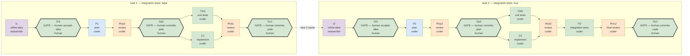

# kanban-smoke-test

**A coding-team kanban board.** Hermes profiles build real work on a kanban board from a
generic lane template, instantiated per board: the researcher refines the idea, the
coder plans, writes tests, implements and reviews, and a human gate authorizes each
step. The driver (`driver/run.py`) sequences the cards and never commits.

A **lane** is one full instance of the card graph executing one idea. Lanes are
capacity, ideas are demand: file N lanes, enter ideas, and the board runs them in
order. A lane opens on a RAW idea and reaches the plan card only through a gate — `I`
refines what you typed into a stated problem, scope, open questions and success
criteria, and `Gi` is where you accept that refinement. Fixing an idea costs one card;
fixing a plan built on a bad idea costs the lane.

Design, driver internals, known traps and timing: **[DESIGN.md](DESIGN.md)**.

## The boards

Six board directories ship as runnable examples. The table says what each one *is*;
how its runs went is not kept here — the runs describe themselves (§4).

| board | idea | lanes | gates, per-card ceiling |
|---|---|---|---|
| `is-even` | one Python function (`is_even`) and its tests — the cheap smoke board, no build tool, no dependencies. Was `minimal-development` until 2026-09-13. It runs on the profiles' cloud models with the goal judge on `C` only (the canary for the judge after a `hermes update`); its README says how to point it at the local rig, and records the local-model runs | 1 | auto, 25 min |
| `roman-evaluator-js` | a browser page: `roman-evaluator.html`, a DOM-free parsing module with unit tests, `run.sh`, two launch modes | 1 | auto, 30 min |
| `roman-evaluator-java` | the same problem twice: a roman CLI (`roman-cli/`) then a spec-first Spring Boot service (`roman-service/`) consuming lane 1's rule; needs JDK 17, Maven, a warm `~/.m2` | 2 | auto, 20 min |
| `portfolio-engineering` | a GPW small-cap research pipeline built into the Hermes `trader` profile (external `default-workdir`) | 1 | Gi auto; Gp/Gc human, 60 min (default) |
| `blade-workspace` | implements a committed plan, task by task, in an **external** repository (`default-workdir`): refinement, unit and integration tests on, the goal judge on `C` and `TI` only | 1 | Gi auto; Gp/Gc human, 60 min |
| `arena-federated-search` | the same shape against a second **external** repository: a Maven/Spring Boot multi-module service whose plan is all `mvn … test`, so unit tests are on and integration tests off (no `TI`/`RVc`); the goal judge on `C` only | 1 | Gi auto; Gp/Gc human, 60 min |

Every shipped board pins its review cards (`RVp`, `RVa`, `RVc` and their rework rounds)
to a different model from the one that did the work — `"model_override":
"deepseek-v4.1-flash"`, `"provider_override": "opencode-go"` — so the review model is
independent of the author. Every other card runs its profile's own model: `"model"` /
`"provider"` are the board's WORK model, filed on every card and overridable per lane
from an idea header, and the pin wins over them on the reviews. Neither key has a default,
so a board that wants either says so.

The engine is **one layer and the driver**. `template/` holds what the driver imports —
the card graph, the option declaration, the body renderer, the board lock, the card bodies
and the role souls. `driver/` holds the kanban driver's own: `run.py` and its tools, reports
and `.sh` entry points. `tests/` is one suite over both, run by `./test.sh`, and
`tests/test_layer_boundary.py` is what keeps the layers apart.

`driver/run-card.py --run boards/<slug>/runs/<run> --card <CODE><lane>[-rev-<n>|-r<k>]` runs
ONE card of an existing run and nothing after it. The run directory is the card's whole
input. The card runs on a one-card board holding stubs of the cards done before it, which
carry their results and hand-off files, on the model `board.json` names at that moment. It
writes into the run exactly what the full board would: hand-offs, artifacts, the work tree,
and the driver's records (`cards/`, `chain.jsonl`, `verdicts.jsonl`, `timing.jsonl`). It
overwrites what the card overwrites, so copy the run (`runs/<run>-try1`) and save the work
tree first. On the copy, any input can be edited by hand. A revision card (`P1-rev-1`,
`C1-rev-1`, …) runs only when the run holds the REJECT (or Gi REWORK) that triggers it,
within the board's `max-reworks`. A re-review (`RVp1-r2`, `RVa1-r2`) runs only when the run
holds the done revision it follows. Gates are refused. It exits 0 only when the card
finished and the driver can read its finish — a review's verdict is read as the driver
reads it, probe rule included. Its worker is stopped on every exit path.

`tests/integration/` is the LLM-gated surface (skipped unless `KANBAN_LLM_TESTS=1`). It
copies the fixture board `tests/integration/fixtures/greet/` to a temp dir and runs
`run-card.py` on it: the planted-defect plan must come back `REJECT` from RVp1, and
`P1-rev-1` must close the findings without rewriting the plan
(`KANBAN_RUN_CARD_REPEAT=1` also checks that two reviews differ). The fixture's
`board.json` names the local model, so an integration run never reaches a cloud provider.
`tests/test_fixture_run.py` checks the fixture itself for free.

What the template consists of:

| file | role |
|---|---|
| `template/lanes.py` | card graph and idea parsing |
| `template/board_schema.py` | the board's options: one declaration, and the validator all three doors run (`--any-host` validates a board whose `default-workdir` lives on another machine — CI) |
| `template/card_render.py` | what a card body SAYS, and where a lane's hand-offs live |
| `template/driver_lock.py` | the board's one driver lock: stale holder taken over, live holder refused |
| `driver/file_lanes.py` | filing: `hermes kanban create`, the idea cards, the run-id mint |
| `driver/create-board.sh` | board instantiation |
| `driver/start-board.sh` | driver launch |
| `driver/arm.sh` | the go signal from a shell: files the idea as a `blocked`, unassigned card, and starts the board's driver if none is up |
| `driver/reset.sh` | archive the cards, unstage leftovers, stop this board's driver |
| `driver/driver-pid.sh` | the live-driver question `reset.sh` and `create-board.sh` both ask |
| `driver/run.py` | the driver |
| `template/card-bodies/` | what each card tells its worker |
| `template/roles/` | the profiles' SOULs |
| `driver/run-audit.py` | the per-run auditor (§4) |
| `driver/run-card.py` | one card of an existing run, on a one-card board |
| `driver/doc-chain.py` | what each card was given and produced |
| `driver/render-flow.py` | the diagrams, checked against `LANE_CARDS` |
| `driver/runs_util.py` | `runs/` and the ledger, read by the auditor and the driver |
| `driver/timing-report.py` | per-card agent time vs dispatch gap |
| `driver/runs-report.py` | what `runs/` holds and costs — reports, deletes nothing |
| `driver/review-package.sh` | one task's scoped commits + diff, for a review |
| `test.sh` | the suite, through an interpreter that has pytest (the shell's `python3` does not) |
| `template/board.schema.json` | the generated JSON Schema (write it with `board_schema.py --write-schema`) |

---

## 1. What the board enforces (design)

In [DESIGN.md](DESIGN.md#what-the-board-enforces), with the lane shape, the rework
loops, the driver's behaviour, the [known traps](DESIGN.md#known-traps) and the
[timing instrumentation](DESIGN.md#timing-instrumentation).

---

## 2. Prerequisites

```
hermes profile list                            # researcher and coder exist
lsof ~/.hermes/kanban/.dispatcher.lock         # SOMETHING owns dispatch
```

**One gateway must hold `~/.hermes/kanban/.dispatcher.lock`.** Without it a board files
perfectly and then sits forever, which looks exactly like a slow one.
`create-board.sh` checks this and refuses.

**A worker does not need its own profile's gateway.** The dispatcher spawns each worker
as a `hermes -p <assignee> --cli …` subprocess, so a profile whose gateway is stopped
still works a card. Only *notification* delivery needs a running gateway: the
`notifier_profile`'s, with its platform connected.

**Profiles.** The graph addresses profiles directly:

| profile | cards |
|---|---|
| `researcher` | `I` — refines the raw idea |
| `coder` | every other work card: `P`, `TW`, `C`, `TI`, `RVp`, `RVa`, `RVc` |
| `trader` | no card |

Gates have no profile — a person completes them, or the driver does with `auto-gates`.
`create-board.sh` derives the profiles a board needs from its manifest and checks they are
there before filing anything: a profile on disk (`~/.hermes/profiles/<name>`, the root the
core itself resolves) counts even when `hermes profile list` is silent about it — that silence
is a note, not a refusal, because a CLI that failed must not read as a missing profile. The CLI's
list still counts for a profile rooted elsewhere. The SOULs, the
drift check and the install commands are in [template/roles/](template/roles/README.md);
why one work profile is enough is in [DESIGN.md](DESIGN.md#profiles-and-the-worker-contract).

**Toolchains belong to boards, not here.** The card graph never mentions a language or
a build tool, and a board is as likely to be Python or Rust as Java. Each board's
`README.md` states what its ideas require, and its build descriptor (`pom.xml`,
`pyproject.toml`, …) is board output like everything else it generates.

## 3. Creating and running a board

A board is a **directory**. Everything specific to one board lives in it, and nothing
about it lives under `template/` or `driver/`:

    boards/<slug>/
        README.md             this board's preconditions and toolchain
        board.json            the board's options — `template/board_schema.py --schema`
                              prints the set. Carries `$schema` →
                              template/board.schema.json (generated), so an editor
                              validates the manifest as you write it
        lane-1.md             the idea for lane 1 — the one copy, edited in place
        work/                 what the lane builds — tracked
        runs/current          a file naming the live run
        runs/driver.log       the DRIVER's log and lock — board-level, because one
        runs/driver.lock      serve-mode driver answers many ideas
        runs/<run-id>/        one armed idea's run, minted then never touched:
            artifacts/lane-<k>/refined.md   by the researcher, edited at Gi
            artifacts/lane-<k>/plan.md      by the coder
            snapshots/lane-<k>.md           the idea as the lane opened on it
            snapshots/lane-<k>-workdir-at-open.md   what the tree held then
            driver.log, chain.jsonl, verdicts.jsonl, timing.jsonl, cards/,
            run-summary.json, halt.txt, scratch/<card-id>/

Create and serve:

    $EDITOR boards/<s>/lane-1.md              # optional: prefill the idea
    driver/create-board.sh --board boards/<s>
    hermes kanban boards switch <s>           # create registers the board but does NOT
                                              # make it current — without this the cards
                                              # file and no worker ever spawns
    driver/arm.sh --slug <s> [--lane <n>]    # the go signal — prefer it to the drag, see below.
                                             # It starts the driver too when none is up, which
                                             # is the usual case: a driver exits with the run
                                             # it drove (see below)
    driver/start-board.sh --slug <s>         # the driver alone: for arming in the dashboard

`driver/create-board.sh --help` is authoritative (including the empty board you get
with `--slug`/`--title` instead of `--board`). There is no import step: `lane-1.md` is
filed onto the Triage card as the LIVE copy of the idea, and arming adopts the CARD and
writes it back over the file — so edit the card, not the file, until the lane is
activated.

A filing mints the run its cards are filed into, and a **re-filing reuses the run a
previous filing minted and no driver ever started** (`runs/current` names it) — so a
retried filing cannot leave a second, never-driven run directory behind, which the
audit would report as E1 "no driver.log — the run never started" for ever. A run a
driver has written into is never reused: paste its id into `start-board.sh` instead.

### The main loop is the dashboard

`start-board.sh` serves: the driver waits for the go signal and **releases nothing**. You
drive the board from `http://127.0.0.1:9119/kanban`:

1. Write the idea into the board's Triage card — edit it right there.
2. **Drag it from Triage to Todo.** That is the go signal — a shell makes the same one with
   `driver/arm.sh --slug <slug> [--lane <n>]`, which creates an unassigned card carrying
   the idea (`armed_ideas` reads either, because what it tests is that an unassigned card
   has left Triage). A driver has to be up to read the drag, and it exits when its run
   finishes, so every idea needs one — started before the drag or after it: a driver with
   nothing to drive (no lane opened yet, or the last run already finished) runs no tick,
   waits up to 30 min for the go signal (`--arm-wait-min`), and exits 0 if none comes. A
   card armed while nothing drives just waits.
   **When `kanban.default_assignee` names a profile, prefer `arm.sh`:** the
   dispatcher assigns an unassigned `ready` card and spawns a worker on it within seconds,
   and `armed_ideas` then skips it (it ignores any card with an assignee), so the lane never
   opens. `arm.sh` files its card `blocked`, which the dispatcher never claims.
3. The driver validates the card's headers and the board's manifest, adopts the text
   into `lane-<k>.md`, mints `runs/<run-id>/`, archives the previous run's cards, files
   a fresh lane set, and drives it. If validation fails it files nothing and comments
   the findings on the card — fix the text there and the next tick re-reads it.
4. Act on the gates as they open — or, on an auto-gated board, watch them close. When
   the last closes the run is over and **the driver exits with it** — a driver is a batch
   job, not a daemon, and one left up polls a finished board for ever. The next idea is
   the next `driver/start-board.sh --slug <slug>`; until you run it there is nothing
   serving the board.

A new idea in the card starts a new run. A board created with idea files is
**prefilled, not running**: the seeded text is an initial value you can rewrite before
arming.

**When a run ends: three scenarios.** The driver is a batch job — it exits when the run it
drove finishes, and it exits on a halt too. So "what now" has three answers, and the first
thing to read is always the end of `boards/<s>/runs/driver.log`.

**1. The run finished — you have another idea.** The board keeps its cards and its `runs/`
while nothing drives it, and another idea is another run on the same board:

1. Write it: `$EDITOR boards/<s>/lane-1.md` — or edit the board's Triage card in the
   dashboard.
2. One command: `driver/arm.sh --slug <s>`. It files the go signal AND starts the board's
   driver when none is up (a finished board has none — the driver exited with its run), so
   this is the whole "next idea" gesture. Arming from the dashboard instead? Then start the
   driver yourself, before or after the drag: `driver/start-board.sh --slug <s>` (it waits
   up to 30 min for the drag without ticking the finished run), and prefer `arm.sh` when
   `kanban.default_assignee` names a profile (the race in item 2 above).
3. The driver adopts the text, archives the previous run's cards, mints a fresh
   `runs/<run-id>/`, files a fresh lane set and drives it; the gates behave as in the
   first run. Repeat from 1 for the idea after that.

Nothing is reset between runs: `runs/current` names the run the board is on (the finished
one, until the next idea is adopted), no run directory is ever reused or deleted, and
`driver/reset.sh --board boards/<s> --batch` is for abandoning a board, not for the next
idea.

**2. The board halted.** Something the lane could not get past stopped the driver — a
provider quota wall (an exhausted token pool), a worker that kept dying, an upstream
outage, a card that spent its runtime ceiling, an unreadable card or the same tick error
for a minute, a run in which nothing moved for 15 minutes (`quiescent`), the run's own
`--timeout-min` cap. EVERY stall gets the same treatment, whatever the reason: the card is blocked,
the reason is commented on it, and the board halts ([DESIGN.md: stall classes](DESIGN.md#stall-classes)).
What you find:

- no driver running (`driver/start-board.sh` starts one; the left-behind lock is taken over),
- `boards/<s>/runs/<run-id>/halt.txt` with the reason, and `BOARD HALTED: …` in the log,
- an `ESCALATION: …` comment on the card, carrying the recovery steps,
- that card blocked as `HALTED: <the stall> — <why>` — the DRIVER's block, not the worker's,
- one notice (`runs/deadman.txt`, and Telegram when it is configured).

Then, in this order — the same recovery for every halt:

1. Read the reason: `runs/<run-id>/halt.txt`, then the full log.
2. Fix the cause: the provider/key/token pool, the endpoint or the board's
   `model`/`provider` pin, the ceiling the card hit, whatever made a card unreadable.
3. Release the driver's own block, with the driver still down:
   `hermes kanban --board <s> unblock <id>`. The driver never releases a `HALTED:` block, and
   a card the halt left SHORT OF DONE stops the next run the same way — let it reach done
   first (a `done` card keeps its history without re-halting).
4. Start the driver: `driver/start-board.sh --slug <s>`. It rejoins the SAME run and reopens
   every card's retry budget — your restart is the "try again" decision.
5. Only if the run cannot continue, reset it:
   `driver/reset.sh --board boards/<s> --batch; hermes kanban boards rm <s>; driver/create-board.sh --board boards/<s>; driver/start-board.sh --slug <s>`

Do NOT drag the halted card to Done, block it or archive it: that releases the lane without
the work, or stops it again.

**3. Goal mode, and the judge LLM blocked the card.** Goal mode is the board option
`goal-cards`: the auxiliary `goal_judge` LLM reads the worker's claim before its card may
complete, so a judge that cannot answer wedges every card it is armed for. It reaches a halt
in one of two shapes, and the recovery is scenario 2's:

- **the judge ran out of road** — the worker card is blocked with `Goal-mode worker exhausted
  its turn budget`, and the driver stops it. The message names the usual cause: a failing
  goal judge, whose failure reads as `continue`, and points at
  `~/.hermes/profiles/<assignee>/logs/agent.log` for `goal judge: API call failed`.
- **the judge's own API failed** — those lines are counted as upstream errors, so the
  attempt is a provider storm: one re-queue in the open, then the next failure halts.

Fix the judge (its provider/model — `auxiliary.goal_judge`; a managed pin wins over the
board's own model), then recover exactly as in scenario 2. `goal-cards` is read at FILING
time, so turning goal mode off means re-creating the board — restarting the driver does not.
And a judge is only ever armed on the cards `goal-cards` lists, never on a review or a gate:
a judge can push a card whose success case is *blocking* into completing, which would
silently open the gate that card guards.

Do **not** use the dashboard's `specify` button to promote the card: it rewrites your
idea with an auxiliary LLM before the researcher reads it. Drag it.

`start-board.sh` is idempotent — a second call sees the driver's lock and exits 0. Do
**not** put it on a `* * * * *` cron: a driver exits with its run, so every minute would
start another driver that waits up to `--arm-wait-min` for an idea nobody armed — a
standing waiter again. After a reboot, one `start-board.sh --slug <slug>` resumes a run
that was in flight (it rejoins `runs/current`).

`--once` releases lane 1 immediately and exits when the gates close. It is for tests
and recovery, not daily use.

### Where work lands

**Nothing a board generates leaks outside its work directory**, `boards/<slug>/work/`
by default: the only tree the driver runs git in, and where every card stages, so the
template repo never accumulates one board's build files. A board that must build in
another repository sets `default-workdir` in its manifest, as `blade-workspace` and
`portfolio-engineering` do. It is always an ABSOLUTE path, because three different
current directories resolve it and `~` is never expanded. A lane that must also write outside
its workdir — into a Hermes profile, say — names those roots in `targets`: cards may
write there, reviewers count the files as the lane's, and git never runs there.

`work/` is **tracked**: the human's commit at a gate puts the deliverable in history and
a clone carries it (only `node_modules/` and tool caches are ignored). `runs/` is
gitignored per-run state, never staged, because hand-offs travel by path. A new idea
inherits `work/` as it is, because a follow-up idea may be a fix of what the previous
run built. The driver pins the work directory's branch and HEAD per run and reports —
never corrects — a switch, a commit or a foreign staged path (E17); see
[DESIGN.md](DESIGN.md#work-directory-pinning).

**Nothing deletes anything** — not `work/`, not a run directory, not the caches a
worker leaves in `work/` (reported as note E16). There is no flag that clears either
tree; `rm` them yourself. `scratch/<card-id>/` is the part that grows without bound;
`driver/runs-report.py --board <slug>` prints each run's size and age and the `rm` for
the finished ones, without running it — and names a run that never opened a lane, which is
what a filing the arm superseded leaves behind (only `runs/<run-id>/driver.log` is written,
so nothing ever reads it as a stalled run).

### Lanes and per-lane options

File as many lanes as you have ideas: an empty lane is up to 11 parked cards nobody
reads, and a lane whose idea is missing stops the chain anyway.

Per-lane options take a scalar or a per-lane array in `board.json`, and an idea header
overrides them for that lane:

    "integration-tests": [false, true]     # board.json — lane 1 without, lane 2 with
    <!-- integration-tests: false -->      # lane-<k>.md — this lane only

An array must have exactly one entry per lane: a missing entry would become a silent
default, and a lane quietly gaining or losing cards is what the array prevents. Each
triage card prints the resolved options and where each came from, and flags a
disagreement loudly — the header is an HTML comment, invisible in a rendered view.

### Resetting

Re-create a board after engine changes:

    driver/reset.sh --board boards/<slug> --batch  # stop driver + workers, archive cards, unstage
    hermes kanban boards rm <slug>                  # reset archives cards, not the board
    driver/create-board.sh --board boards/<slug>
    driver/arm.sh --slug <slug>                     # the go signal; starts the driver too

Run `reset.sh` first, not `boards rm` alone: `create-board.sh` refuses (exit 6) while the
board's driver is still running, because a driver reads a half-filed run as a failed filing
and halts. Mid-run, a removed board halts the driver at once: `was removed under a live run`
in `driver.log`. A driver that was only waiting for an idea logs `BOARD REMOVED` and exits 0
— it had no run in flight to halt.

### How it flows (diagram)

Both pictures below are GENERATED from `template/lanes.py` by `driver/render-flow.py`,
so they cannot drift from the card graph — run it after touching `LANE_CARDS`;
`--check` fails if anything is stale. The editable copy is `driver/flow.drawio`
(colour per profile, thick borders = gates).

<!-- BEGIN generated: driver/render-flow.py -->


```mermaid
flowchart LR
  subgraph L1["lane 1 — integration-tests: false"]
    direction LR
    I1["I1<br/>refine idea<br/><i>researcher</i>"]
    Gi1{{"Gi1<br/>GATE — human accepts idea<br/><i>human</i>"}}
    P1["P1<br/>plan<br/><i>coder</i>"]
    RVp1["RVp1<br/>review<br/><i>coder</i>"]
    Gp1{{"Gp1<br/>GATE — human commits plan<br/><i>human</i>"}}
    TW1["TW1<br/>unit tests<br/><i>coder</i>"]
    C1["C1<br/>implement<br/><i>coder</i>"]
    RVa1["RVa1<br/>review<br/><i>coder</i>"]
    Gc1{{"Gc1<br/>GATE — human commits code<br/><i>human</i>"}}
    I1 --> Gi1
    Gi1 --> P1
    P1 --> RVp1
    RVp1 --> Gp1
    Gp1 --> TW1
    Gp1 --> C1
    TW1 --> RVa1
    C1 --> RVa1
    RVa1 --> Gc1
  end
  subgraph L2["lane 2 — integration-tests: true"]
    direction LR
    I2["I2<br/>refine idea<br/><i>researcher</i>"]
    Gi2{{"Gi2<br/>GATE — human accepts idea<br/><i>human</i>"}}
    P2["P2<br/>plan<br/><i>coder</i>"]
    RVp2["RVp2<br/>review<br/><i>coder</i>"]
    Gp2{{"Gp2<br/>GATE — human commits plan<br/><i>human</i>"}}
    TW2["TW2<br/>unit tests<br/><i>coder</i>"]
    C2["C2<br/>implement<br/><i>coder</i>"]
    RVa2["RVa2<br/>review<br/><i>coder</i>"]
    TI2["TI2<br/>integration tests<br/><i>coder</i>"]
    RVc2["RVc2<br/>final review<br/><i>coder</i>"]
    Gc2{{"Gc2<br/>GATE — human commits code<br/><i>human</i>"}}
    I2 --> Gi2
    Gi2 --> P2
    P2 --> RVp2
    RVp2 --> Gp2
    Gp2 --> TW2
    Gp2 --> C2
    TW2 --> RVa2
    C2 --> RVa2
    RVa2 --> TI2
    TI2 --> RVc2
    RVc2 --> Gc2
  end
  Gc1 -. lane 2 starts .-> I2
  classDef idea fill:#e1d5e7,stroke:#9673a6;
  classDef plan fill:#dae8fc,stroke:#6c8ebf;
  classDef review fill:#ffe6cc,stroke:#d79b00;
  classDef build fill:#d5e8d4,stroke:#82b366;
  classDef gate fill:#d5e8d4,stroke:#333,stroke-width:3px;
  class I1,I2 idea;
  class P1,P2 plan;
  class RVp1,RVa1,RVp2,RVa2,RVc2 review;
  class TW1,C1,TW2,C2,TI2 build;
  class Gi1,Gp1,Gc1,Gi2,Gp2,Gc2 gate;
```

*Generated from `template/lanes.py` by `driver/render-flow.py`; editable copy in `driver/flow.drawio`.*

<!-- END generated -->

ASCII fallback:

```
  lane 1 (integration-tests: false)
  I1 → Gi1 → P1 → RVp1 → Gp1 ─┬─ TW1 ─┬─ RVa1 → Gc1 ──┐
   │     │                     └─ C1 ──┘               │
   │     └─ the refined idea is accepted here          │ lane 2 starts
   └─ researcher: raw idea → refined.md                ▼
                                                  lane 2 (integration-tests: true)
  I2 → Gi2 → P2 → RVp2 → Gp2 ─┬─ TW2 ─┬─ RVa2 → TI2 → RVc2 → Gc2
                              └─ C2 ──┘
```

**Rework.** A review that REJECTS files a revision card and a re-review; the idea gate
does the same when completed with `REWORK: <answers>`. Each of the three loops (plan,
code, idea) allows `max-reworks` rounds — default 3; the shipped boards vary:
`is-even`, `portfolio-engineering` and `roman-evaluator-js` set 2, `roman-evaluator-java` 3,
and the two external-repo boards (`blade-workspace`, `arena-federated-search`) 4 — then
escalates and halts the board. There is no rework loop on `I`
by default: the idea gate is the loop, and you are it — edit `refined.md` at `Gi`
rather than sending the card back.

A REJECT carries two halves — the findings, and a `VERIFIED:` ledger of the checklist
items the review ACCEPTS. What the revision must leave alone is computed from both: **the
ticked items minus the ones the findings name**, so a verdict cannot accept ground it is
asking to be changed (a live one ticked items 1, 3 and 4 and named 1, 4, 5 and 7; the
rework card was told the review ACCEPTED items 2, 6, 8). The driver measures how much each
round changed against the version it was sent, and calls a ≥60 % rewrite a REGENERATION.

**The plan is probed, not read.** `template/probe.py` builds the plan's own files in a
scratch copy of the work directory and runs its Run commands there, one call, writing
`probe-log.md`. The planner runs it before completing; the plan review runs it first,
every round, in full, and labels every fix `VERIFIED FIX:` (it ran it) or `SUGGESTION:`.
A plan-review PASS without its own complete, clean probe log for that version of the
plan is an UNPROBED PASS: the driver files the review again (twice at most, outside
`max-reworks`), never a plan revision, and after that the plan gate waits for a person
even on an auto-gated board. A code card that finds a plan step the toolchain rejects
makes the smallest correction and declares it `DEVIATION:`; the code review re-derives
it, and once the code gate passes the driver carries it into
`boards/<slug>/toolchain-facts.md`, which the next run's researcher and planner read
first. Mechanics in [DESIGN.md](DESIGN.md#rework-loops).

**Gates** cost 0 agent minutes because the driver completes them itself — on an
auto-gated board as "auto-gate: … NOTHING COMMITTED", otherwise as "HUMAN COMMIT
REQUIRED" (§6).

---

## 4. Run records

Each run's state lives in `boards/<slug>/runs/<run-id>/`, never rewritten by the next run
and never deleted. No summary of runs is kept here — a hand-maintained copy ages on every
run — so read the runs themselves:

    driver/run-audit.py   --runs boards/<slug>/runs              # the current run
    driver/run-audit.py   --runs boards/<slug>/runs/<run-id>     # any earlier one
    driver/doc-chain.py   --runs boards/<slug>/runs [--history]
    driver/timing-report.py --board <slug>
    driver/runs-report.py --board <slug>                      # what runs/ holds, newest first

`--runs boards/<slug>/runs` reads the run `runs/current` names;
`--runs boards/<slug>/runs/<run-id>` reads that one.
A run directory that carries a `state.json` and no `run-summary.json` — the old bot
driver's `--resume` file — is not a kanban run: `run-audit.py` says which record it is
missing and exits 2, rather than reading its log alone and reporting a phantom "driver
died". A run with no `state.json` is still a kanban run however it ended, and still gets
audited: a halted one reports E1 and E4 and exits 1.

**Audit every run; that is the loop's stopping rule.** `run-audit.py` exits 0 only when a
finished run has no errors and no warnings. It reads the driver log (terminal state,
including a driver that died: no halt, no finish banner and no live process holding
`runs/driver.lock`; error vocabulary; held gates) — `runs/driver.log` for the board's log,
which is append-only across every run the board ever had, or `runs/<run-id>/driver.log` for
one run's, which is what a script wants — `run-summary.json` (gate wording, restarts, per-card
budget against the board's ceiling), the document chain, the workers that outlived the
run and the board's end state, then prints the per-card table and wall/agent/overhead.
It also reads the cards' own logs, which is the only place a **provider storm the run
survived** can be seen (E18: one warning per card, with the count and the first line,
counting only this run's attempts in a log the card keeps across runs) —
the driver's record says nothing about a flake whose worker retried and finished.
A warning alone fails it. The loop is: run, audit, fix, run again — no cycle is done
while the auditor reports anything.

A halted board writes its reason to `runs/<run-id>/halt.txt`, comments it on the card
where there is one, sends it once as a notice (`deadman.txt`, Telegram when tokens are
set), and the driver exits. Short of a halt, a deadman notice means two or more blocked
cards are waiting on a human — cards the driver will still re-promote are not counted. A
live run in which nothing is in flight for 15 minutes — no card todo, ready or running,
no human gate held, no driver write — is not left to the deadman: it halts as
`quiescent`, naming the blocked cards.
Every halt and what it says: [DESIGN.md](DESIGN.md#stall-classes).

**Worker sessions** are not in `runs/`. Each card's worker runs in its assignee
profile's session store, tagged `source=kanban` and titled `Work kanban task <task-id>`.
Hermes Desktop hides them from every session list, so read them
with the CLI:

    hermes -p coder sessions list --source kanban --limit 20
    hermes -p coder sessions export --session-id <id> --format html <file>.html
    hermes -p coder sessions export --session-id <id> --format md [<dir>]   # default <hermes home>/session-exports
    hermes kanban --board <slug> show <task-id>                             # which card a task id is

**Why no switch makes them visible.** A worker's session is created under
`HERMES_SESSION_SOURCE=kanban`, set unconditionally by the dispatcher
(`hermes_cli/kanban_db_dispatch.py`), and it is excluded because every human-facing listing applies
Hermes's internal-listing deny list (`hermes_state_sessions.INTERNAL_LISTING_SOURCES`, beside `tool`
and `oneshot`). There is no manifest or environment switch — one row per attempt would flood the
session lists — so the CLI above is the way in. **Never rename a worker session to `Bot Chat` to
force it into view**: that is the session-stealing bug class Bot Mode's canonical-chat registry
exists to prevent.

**Hermes still reports one, though.** `profiles.list` carries `worker_session` per profile — the
newest *denied* row, i.e. the freshest kanban worker, with its id, source, title and `last_active`
(`tui_gateway/methods_profiles.py`) — so a roster can show a profile as working. Desktop's Bots
plugin reads it as `{last_active}` for its working dot, and its session menu can open an arbitrary
session id from a bot row. Surfacing the live worker in the Bots tab is therefore a Desktop-side
change (widen the type, add a menu item) and needs no kanban- or backend-side work. In the web
dashboard, sessions are per profile (`/sessions?profile=coder`) and the Automation category does not
include `kanban`, so worker runs appear under All/Chats.

## 5. Operational rules

- **One driver per board.** Duplicates idle silently and interleave log output. Kill
  all, start one. The scope is the board, not the machine — other boards run
  concurrently — and boards share model capacity: the same profiles and the same
  backend serve every board at once (`sequential`, and Desktop's Warm Bot Backends,
  are the knobs for that). A restart is safe: it rejoins this run's lanes and the
  one-shot allowances the run already spent, and recovers a driver that stopped
  without a halt. It does not undo a halt that rests on the board's record — only
  `driver/reset.sh` clears that ([restart and reset](DESIGN.md#restart-and-reset)).
- **Re-filing mid-run is forbidden.** `create-board.sh` refuses if the board exists.
  To start over, `driver/reset.sh --board boards/<slug>`: it stops this board's
  driver (the pid in `runs/driver.lock`), unstages its leftover index entries, then stops
  its workers and archives its cards — one board only,
  nothing deleted, no `git reset`, no force-push. Orphaned workers otherwise burn full
  budgets on archived cards and re-stage stale content.
- **A failure is final; only a REVIEW retries work.** Every card, revision cards
  included, gets one attempt, so a timeout, crash or failed spawn halts the board there.
  Work comes back only through a review that REJECTS. So `max-retries` is 1 and the
  schema refuses any other value; the count you choose is `max-reworks`. Two bounded
  exceptions, each announced by a comment on the card: a **provider-starved** attempt is
  re-queued **once** (never a timeout), and a card its **own worker blocked** is
  re-promoted **once**; the next failure or block halts. A spent goal-loop turn budget,
  a block with no reason, or a block the driver set, halts at once. A **reclaim** is not a
  failure of the work: the dispatcher writes `pid N not alive` for a worker whose process
  is gone and then retries the card itself, so the driver halts only when NOTHING has
  moved since the reclaim — a spawn, heartbeat or completion newer than it means a live
  retry. (Measured 2026-09-27: restarting a board halted it five minutes in on a stale pid
  from the attempt *before* the restart, while that very card reached PASS in the same
  minute.) Evidence thresholds
  and messages: [block origins](DESIGN.md#block-origins) and [stall classes](DESIGN.md#stall-classes).
- **Every other stall halts the board, naming its cause** — rework rounds exhausted, a
  card the engine escalated to Triage or keeps retrying without counting a failure, a
  gate that waits for 10 minutes with every parent done, the same tick exception for a
  minute, a lane card archived by hand, a run with no cards to drive, a live run with
  nothing in flight for 15 minutes, the run's `--timeout-min` cap — because the lane
  cannot advance by itself and polling would read as a stall. Two of them (a failed
  refile and a restart onto its empty run) name the [Resetting](#resetting) sequence,
  because the armed idea card is already archived. The full decision tables:
  [how a lane avoids and escapes a stall](DESIGN.md#how-a-lane-avoids-and-escapes-a-stall).
- **`kanban.auto_decompose` must be off.** hermes decomposes every Triage card on every
  board and runs the pieces; the board parks its next idea in Triage. `create-board.sh`,
  `arm.sh`, `start-board.sh` and the driver refuse (exit 7) while it is on for the root
  configuration or the board's profiles — unset counts as on — and print the
  `hermes [--profile p] config set kanban.auto_decompose false` lines to run.
  `--allow-auto-decompose` overrides, with a WARNING. A driver start that finds cards the
  board did not file halts and names them.
- **Turn budgets are global, not per-profile.** `agent.max_turns` (80) in
  `~/.hermes/config.yaml` governs every kanban worker. A profile-level shadow value
  kills runs — never set `agent.max_turns` on a worker profile.
- **A card's `--skill` resolves against the assignee's own profile.** A name that profile
  cannot see is dropped with a log-only warning, so the card runs without the skill and
  nothing fails loudly — the one case `create-board.sh`'s pre-flight reports for a
  force-loaded skill (`lanes.required_skills`). Install it into the assignee profile
  (`/skill-sync`); the profile the board was created from is irrelevant.
- **Worker cards are turn-bounded; reviews and gates never are.** Worker cards (I, P,
  TW, C, TI and their rounds) are filed with a turn ceiling and, with `goal` on, a goal
  judge that checks the body's `DONE WHEN:` line. A goal judge on a review or gate could
  complete a card whose success case is blocking. Goal mode is off unless `board.json`
  lists them in `"goal-cards"`; see [the goal judge](DESIGN.md#the-goal-judge) before arming it.
  `"goal-cards"` names them, e.g. `["C", "TI"]` for the long implementation cards; its
  rounds follow their base card, and `[]` (the default) is no judge at all. There is no
  separate switch: the list IS the switch. It is read at filing, so changing it means
  re-creating the board.
  Which model judges is not a board option: it is each worker profile's resolved
  `auxiliary.goal_judge` (the managed `/etc/hermes/config.yaml` pin wins), and
  `create-board.sh` prints it per profile in its pre-flight (`goal judge for C,TI (profile
  coder): openrouter / z-ai/deepseek-v4.1-flash`).
- **The review model is a different model.** `model_override`/`provider_override`
  (board-level only, so no lane can buy itself a different review model) go on the
  review cards and their rounds. The goal judge is not affected: it runs on the worker's
  profile model unless the profile sets `auxiliary.goal_judge`. `board_schema` refuses a
  provider without a model.
- **`model`/`provider` are the other half.** The board's work model, filed on every card
  it files and overridable per lane from an idea header, with the review pin above it.
  Naming a work model without a pin puts the reviews back on the author's model — a
  legitimate board (one model for everything) and a bad one to reach by accident, so
  `board_schema` prints a note at the manifest door and the driver logs one per lane.
- **Changing a model mid-run.** Edit `board.json` — the driver re-reads the board and the
  lane file (its two live sources) each time it releases a card, so the change reaches the
  NEXT card, a round's cards included, with nothing else to do. A card already released
  keeps its pin: if the driver's own block or a crash stopped it, and you unblock it by
  hand, release is yours and not the driver's, so re-point that one yourself —
  `hermes kanban --board <slug> set-model <card-id> <model> [--provider <p>]`. Same rule
  from the other side: the driver never undoes a `set-model` you made.
- **Refinement is optional.** `refinement: false` drops `I` and `Gi` from a lane: the
  plan card becomes its root and plans from the raw idea, whose `### Done means` section
  the code gate judges against. The human's first veto moves to the plan gate.
- **Gates are idempotent.** Gate actions use explicit pathspecs (never `git status`
  parsing), skip a gate card already done, and treat "already terminal" as success.
- **Reviewers reproduce, not skim.** A REJECT lists concrete reproduction steps; a PASS
  is earned by re-deriving the result (an independent oracle, a re-run of the launch),
  not by reading the worker's report.
- **Launch outside a delegated child.** With `HERMES_DELEGATED_CHILD_CONTEXT=1` set the
  kanban CLI refuses every mutation; see [DESIGN.md](DESIGN.md#known-traps).

## 6. Gate discipline (stage-only flow)

The authorization chain per lane, with `auto-gates` off:

```
workers stage (git add own paths) + write per-card patch to scratch/ (the driver attaches it)
        ↓
reviewer verifies the STAGED diff (not the worktree)
        ↓
driver posts GATE READY on the gate card
        ↓
human runs the suite, commits with explicit pathspec, pushes
        ↓
human comments PASS (or completes the card) → next lane's root unblocks
```

**The driver never commits and never moves a branch.** Nothing the idea builds enters
history except through a gate commit, and the deliverable is tracked, so that commit
really carries it. Each gate's result names the repository, branch and HEAD it staged
into, and `run-summary.json` records the same as `commit_target`. You commit at your
discretion, or not at all. `template/` and `driver/` (the engine) are committed freely by the operator
between runs.

With a gate listed in `auto-gates` (board.json: `["Gi"]`, or `["Gi", "Gp", "Gc"]` for all) the
driver plays the gate-holder: it verifies the evidence, records it in the gate result,
completes the gate — and still commits nothing; the files stand staged for you. Use it
to smoke-test the machinery and for lanes whose human check is recorded outside the
chain, not for work whose authorization must be a commit.

**Answering a gate from the card.** When a gate's input is valid the driver posts a
comment starting `GATE READY` on the gate card, with its evidence and the reply options.
You answer with a comment of your own whose first word is the verdict — `PASS` (or
`PASS: <your words>`; `ACCEPT` reads the same) or `REWORK: <what is wrong>`. On its next
tick the driver acts on it:

- `PASS` completes the gate with your words as the `--result` (`comment #<n> (<author>)`
  goes in the summary), the same verdict path as the CLI's.
- `REWORK` at the idea gate completes it with `REWORK: …`, and the researcher's
  revision and a re-gate card follow.
- `REWORK` at the plan or code gate files the round that gate's loop files after a
  review `REJECT`, with your words as the findings: a plan revision and plan re-review,
  or a code revision (for the coder, or `OWNER: TW` / `OWNER: TI`) and re-review. The
  gate stays held and says `REWORK APPLIED`. When the re-review passes it posts a new
  `GATE READY` naming that review (`[RVp1-r2]`), and only comments under it count.

Every rework counts against `max-reworks`. The word must stand alone or be followed by `:` or a dash:
`Pass it to Anna` is a note, not a verdict. This works from the CLI (`hermes kanban comment <id> "PASS"`),
the browser dashboard and the desktop app alike. The driver answers on the card with
`NOT APPLIED (comment #<id>): …` instead when:

- the verdict was written before `GATE READY` (the gate was still waiting) — write it again;
- it is `REWORK` with no reason;
- it is `REWORK` and the lane has used all its `max-reworks` rounds — edit the files
  yourself and `PASS`, or stop and reset.

Other comments, and the driver's own (author `kanban-driver`), are ignored. Every gate
card's body says the same, together with what stops the board: blocking a gate by hand,
or moving or archiving it. With `auto-gates` on no comment is read. A `GATE READY` notice
also goes to `runs/<run>/gate-ready.txt`, and to Telegram when `TELEGRAM_BOT_TOKEN` and
`TELEGRAM_ALLOWED_USERS` are set in the driver's environment.

**Completing a gate is also one CLI call** — the gate card is how the lane is released:

    env -u HERMES_HOME hermes kanban --board <slug> complete <CARD-ID> --result "PASS: <what you decided>"

- `env -u HERMES_HOME` matters when you run it from inside a Hermes profile session: the
  profile's `HERMES_HOME` makes `hermes kanban` resolve the *profile's* kanban dir instead of
  `~/.hermes/kanban`, where the boards live. From a plain shell it is a harmless no-op.
- `--board <slug>` names the board explicitly; omit it and the CLI uses whichever board is
  current.
- `--result` is optional to the CLI — the card completes without it. But the finished run's
  audit reads that text for one word — `PASS` at a `Gp`/`Gc` gate, `refined idea present` at
  `Gi` — out of a snapshot written once and never rewritten, so spell the evidence out. The
  gate card's own body prints the same command with its id, and the driver's `HUMAN GATE READY`
  log line names it too.

The **dashboard** completes the same card (the plugin's `PATCH /api/plugins/kanban/tasks/<id>`
calls the same `complete_task`, and *Mark done* stores your summary as both `result` and
`summary`), with two traps: in the **Electron desktop app** the summary dialog is
`window.prompt`, which Electron does not implement, so pressing Complete returns `null` and the
move is silently dropped — answer with a comment instead (above), or use a browser tab
(`http://127.0.0.1:9119/kanban`) or the CLI.

## 7. Filing a new idea (genericity)

The card graph (`template/lanes.py`) and card bodies (`template/card-bodies/`) are shared
by every board — nothing scenario-specific to write per idea. To run new work:

1. Write the idea into `boards/<s>/lane-<k>.md` (or the Triage card) — free text, plus
   optional headers overriding the board's value for that lane only, e.g.
   `<!-- unit-tests: false -->`. The per-lane options, and so the whole header set,
   are `refinement`, `unit-tests`, `integration-tests` and `max-reworks`
   (`template/board_schema.py --schema` prints the table); every other
   option is board-level. A header is a whole line, and
   anything shaped like one is judged as one, so a misspelling is an error rather than
   prose silently ignored. Write paths relative to the board's work directory, so the
   idea stays portable between boards.
2. Create the board (§3): `driver/create-board.sh --board boards/<s>`.
3. Make it current: `hermes kanban boards switch <s>` — creating registers the board but
   does **not** make it current, and the dispatcher follows the current board.
4. Arm it: `driver/arm.sh --slug <s>` — that also starts the board's driver, so there is
   nothing else to do. (Arming by dragging the Triage card instead — see §3 for the
   `default_assignee` race — needs `driver/start-board.sh --slug <s>`, before or after the
   drag.) The driver exits when the run it drove finishes — see "When a run ends: three
   scenarios" in §3 for the run after this one.

Only touch `template/card-bodies/` or `template/lanes.py` when the card graph itself must
change (a new role, a new gate) — that changes every board, not just one idea. See
`boards/` for six worked examples.
